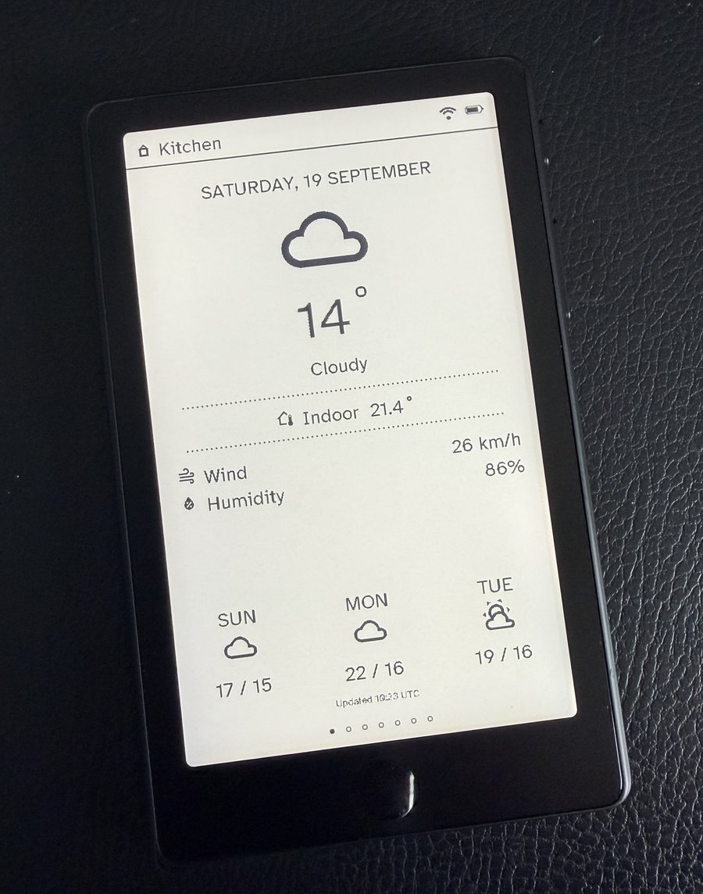
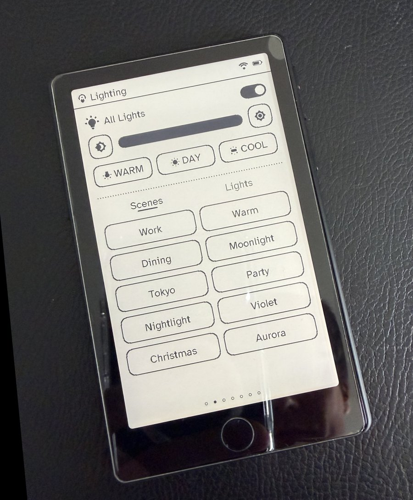
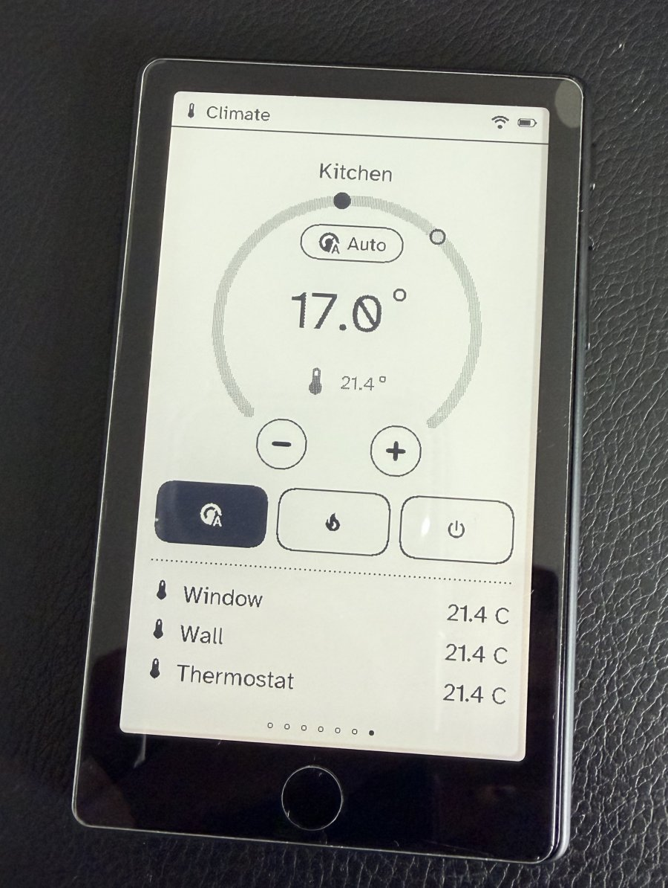
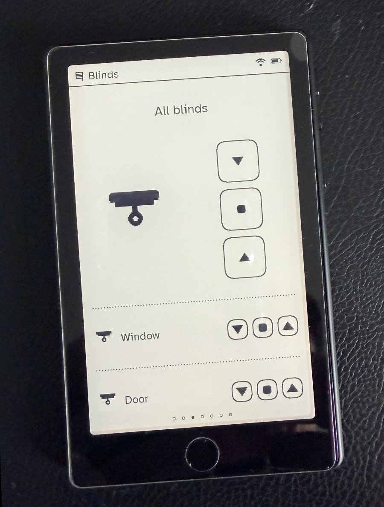
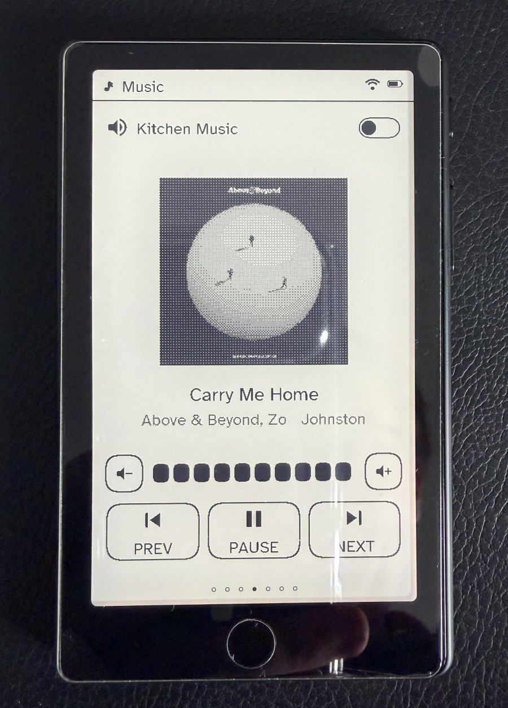
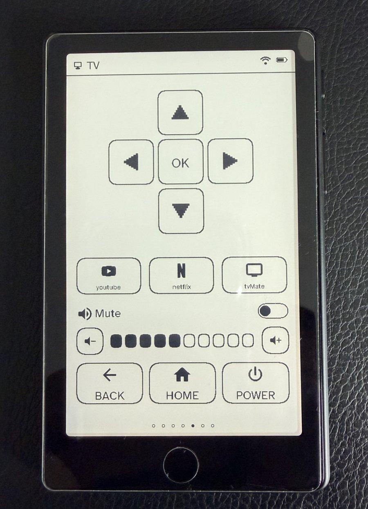
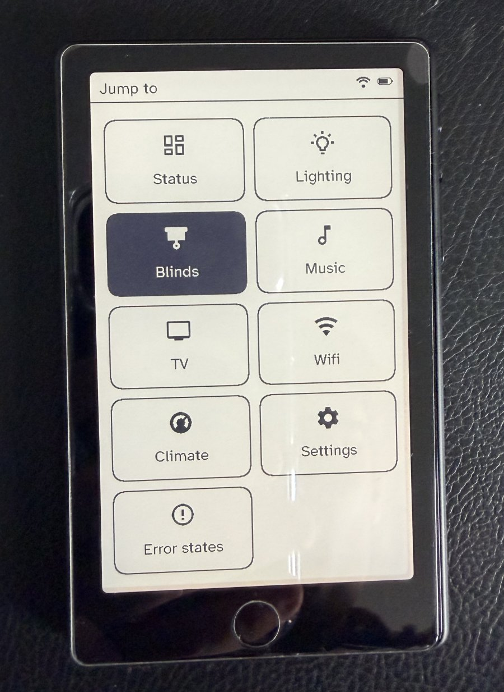

# Switchboard

**[⚡ Flash it from your browser](https://stumarti.github.io/Switchboard/)** — no PlatformIO install needed (Chrome/Edge on desktop only). See [Releases & the web flasher](#releases--the-web-flasher) below.

A PlatformIO firmware for the **Xteink X4 Pro** e-reader that turns it into a wall/desk **smart-home remote**: one e-ink panel, one set of physical buttons, a carousel of rooms-and-devices pages driven by Home Assistant through a small companion server (see [The Switchboard Server](#the-switchboard-server) below).

It's a **standalone project** (not a CrossPoint fork). It drives the hardware through the FreeInk SDK's stable HAL — the same `EInkDisplay` / `InputManager` / `BoardConfig` libraries CrossPoint uses — linked by `symlink://`, so it runs on the real device without vendoring the HAL.

## Gallery

<table>
<tr>
  <td><br><sub>Standby</sub></td>
  <td><br><sub>Lighting</sub></td>
  <td><br><sub>Climate</sub></td>
</tr>
<tr>
  <td><br><sub>Blinds</sub></td>
  <td><br><sub>Music</sub></td>
  <td><br><sub>TV</sub></td>
</tr>
<tr>
  <td><br><sub>Jump to menu</sub></td>
</tr>
</table>

## How it behaves

**Cold boot:** a ~1.2s splash (skippable by any button/tap) → Wi-Fi (tries the saved network silently; on failure, scans and walks you through picking an AP + an on-screen-keyboard password) → straight into the carousel, backlight on. The weather/Home Assistant data fetch runs in the background from the moment Wi-Fi lands — the boot path never blocks on it.

**The carousel** is the home screen: up to 8 pages, **Status** (the deep-sleep dashboard — date, weather, indoor temperature) always first, then **Lighting**, **Blinds**, **Music**, **TV**, **Xbox**, **Wifi** (join QR codes for the household's shared networks), and **Climate**. Left/Right steps through them, skipping any page the current room's server profile has hidden — Status can't be hidden. The device self-sleeps after an idle timeout (configurable) and wakes back onto whichever page it slept on.

**The Home key** does two different things depending on how you press it:
- **Tap** — opens the jump list: every visible carousel page plus Settings, in one tappable list. This is the "Jump to menu" screen in the gallery above.
- **Hold** — opens the control shade, a quick-access overlay for backlight brightness/warmth.

**Settings** (from the jump list, or the shade's cog tile) is a vertical list:
- **Select room** — fetches the Switchboard Server's room list and lets you point this physical unit at a different profile. This is what makes the hardware anonymous: the room lives in the server profile, not in the flashed firmware.
- **Device info** — firmware version, link status.
- **Wi-Fi setup** — forgets the current network and reboots into provisioning.
- **Refresh now** — forces an immediate Home Assistant / server re-fetch.
- **Timeouts** — screen (idle-to-sleep), control-page-revert, and refresh-interval override, each cycling 1/3/5/15/30 min on tap.
- **Developer** — pixel-grid overlay, disable-standby, the hardware self-test ("Button checker"), and a hard reset that wipes the picked room and cached state (the rescue path out of a room whose server config wedges the device on every boot).
- **Restart** / **Back**.

If the server or Home Assistant can't be reached, or no room has been picked yet, the device shows a plain-language error screen instead of hanging — Left/Right/tap retries, Tap Home opens Settings, and Hold Home is a shortcut straight into the hardware self-test below.

## The hardware self-test

Reached via **Settings → Developer → Button checker** (or the Hold-Home shortcut from a No-HA/No-room error screen). It verifies every input surface and the backlight on real hardware:

- **Buttons** — four check-off boxes that tick the first time each is pressed:
  **Left** (GPIO0), **Right** (GPIO7), **Power** (GPIO3), and **Home** (the
  GT911 capacitive key below the panel). On the X4 Pro these *are* the four
  buttons — there is no separate Back/Confirm key in hardware, so the fourth
  tested button is the capacitive Home key. A "N / 4 pressed" tally tracks
  progress.
- **Touchscreen** — a target box showing live `x=… y=…` coordinates, a running
  tap count, and a crosshair drawn at your last touch.
- **Backlight** — steps `0 → 25 → 50 → 75 → 100%` with a level bar. Tap the
  on-screen "Step backlight" button, or press the **Home** key, to advance it.
- **Refresh** — the test repaints with the panel's **partial (fast) refresh**,
  which is what keeps button/touch feedback snappy. Partial refreshes ghost
  over time, so there's a **"Full refresh"** button that does a clean full
  refresh and scrubs the accumulated ghosting. A status line shows the current
  mode and how many partials have piled up since the last full; the test also
  auto-promotes to a full refresh once that count gets high, so it never looks
  dirty during a long session.

**Hold the Home key** to restart the test.

> The partial/full split is exactly the e-ink tradeoff: fast refresh is
> responsive but leaves ghosts; full refresh is clean but flashes the whole
> panel. The button lets you trigger the clean pass on demand.

## Hardware it targets

Selected by `-DFREEINK_DEVICE_X4PRO`, which maps to the SDK's `XteinkX4Pro`
board profile:

- ESP32-S3 (S3R8: 16 MB flash, 8 MB PSRAM), 800×480 e-ink, SSD1677 controller
  (newer units carry a UC8179 instead — the firmware probes for it at boot
  and switches driver/BUSY polarity automatically)
- GT911 capacitive touch on the shared I²C bus
- Nav keys: Left = GPIO0, Right = GPIO7, Power = GPIO3
- Warm/cool PWM frontlight, PCF8563/BM8563 RTC

The firmware reads its pins from `BoardConfig::ACTIVE`, so nothing is
hardcoded — swapping the device flag re-targets it.

## The Switchboard Server

This firmware is a **client**. It doesn't talk to Home Assistant directly, and it doesn't carry any per-room setup — lighting groups, blinds, media players, TV apps, which carousel pages are even visible — on board. All of that lives in a small companion service, the **Switchboard Server**, that runs once per household (not once per remote) and every physical unit reads its config from at boot and on demand.

That server is a **separate project** (a small Node/Express app with its own admin web UI, meant to run in Docker — Stu runs it on Unraid) and isn't part of this repository. This firmware just needs one to exist on the LAN:

- **Discovery** — resolved via mDNS/DNS-SD once Wi-Fi is up. Host and port default to `switchboard` / `45678` — see `SWITCHBOARD_SERVER_HOST` / `SWITCHBOARD_SERVER_PORT` in `include/config.h`.
- **`GET /api/globals`** — the shared Home Assistant connection (host, port, long-lived token) and the household's shared list of Wi-Fi networks (shown as join-QR codes on the Wifi carousel page).
- **`GET /api/devices/<slug>/config`** — this room's settings: which weather/climate entities the Status page shows, the Lighting/Blinds groups and individual lights/scenes, the Music `media_player`, the TV's remote + app list, and which carousel pages are enabled for this room. `<slug>` is picked on-device via Settings → Select room, which itself calls `GET /api/devices` for the list.

Point a fresh unit at your own server by editing `SWITCHBOARD_SERVER_HOST`/`SWITCHBOARD_SERVER_PORT` in `include/config.h` before flashing (or leave the defaults if your server also advertises as `switchboard.local`), then use Settings → Select room on-device to attach it to a room — no rebuild needed to move a unit between rooms later.

## One-time setup

1. **Get the FreeInk SDK** next to this project:
   ```
   git clone https://github.com/Free-Ink/freeink-sdk
   ```
   So your layout is:
   ```
   parent/
     freeink-sdk/
     Switchboard/     <- this project
   ```
   If you put it elsewhere, edit `[freeink] sdk = ...` in `platformio.ini`
   (an absolute path is safest on Windows).

2. **Set your Wi-Fi** in `include/config.h`:
   ```c
   #define WIFI_SSID "your-network"
   #define WIFI_PASS "your-password"
   ```
   Leave `WIFI_SSID` empty (`""`) to boot without a network — Wi-Fi then
   fails fast and the device shows its "can't reach the server" error screen
   rather than the real carousel, so this is mainly useful for bench-testing
   the splash/self-test rather than a full run-through.

3. **Point it at your Switchboard Server** (optional) — only needed if your
   server doesn't advertise as `switchboard.local:45678`, or you want a
   non-default starting room slug:
   ```c
   #define SWITCHBOARD_SERVER_HOST "switchboard"
   #define SWITCHBOARD_SERVER_PORT 45678
   #define SWITCHBOARD_DEVICE_SLUG "office"
   ```
   The slug is just the starting point — Settings → Select room overrides it
   on-device and persists the choice in NVS, independent of what's flashed.

## Build & flash

With the PlatformIO CLI (or the VS Code PlatformIO extension):

```
pio run -e x4pro -t upload -t monitor
```

Wake the device before uploading if it has gone to sleep, or PlatformIO may
fail to auto-detect the port.

> ### ⚠️ About the `Network.h` error (now fixed in this config)
>
> Arduino-ESP32 core 3.x split the `Network` library out of `WiFi`, so
> `WiFi.h` now `#include`s a sibling `<Network.h>` that PlatformIO's dependency
> finder must pull in. Two things break that, and both are handled here:
>
> - **Wrong platform.** The stock PlatformIO `espressif32` ships the ancient
>   core 2.0.17 (no `Network.h` at all). This project pins the **pioarduino**
>   platform (core 3.3.x) — keep that `platform =` URL.
> - **Aggressive LDF mode.** Setting `lib_ldf_mode = chain+`/`deep+` changes how
>   the framework's own inter-library dependencies resolve and stops WiFi from
>   finding Network. This config leaves LDF at its default and instead adds the
>   framework's `Network/src` path explicitly, so it resolves either way. Don't
>   add a `lib_ldf_mode` override.
>
> If you still hit `Network.h` after pulling this config, it's a stale platform
> cached from an earlier attempt. Close VS Code and, in PowerShell, delete the
> framework packages so they re-extract clean:
>
> ```powershell
> Remove-Item -Recurse -Force "$env:USERPROFILE\.platformio\packages\framework-arduinoespressif32*"
> Remove-Item -Recurse -Force "<your-project-folder>\.pio"
> ```
>
> Then rebuild (the correct core re-downloads — a few hundred MB).

### Why there's a Logging.h here

Several FreeInk SDK libraries do `#include <Logging.h>` and call
`LOG_INF(tag, fmt, ...)`, but the SDK deliberately doesn't ship that header —
it expects the app to provide one so log output lands in the app's own Serial
stream. `include/Logging.h` is that shim; it routes every level to Serial. If
you ever see `fatal error: Logging.h: No such file`, it means the project's
`include/` dir isn't on the compiler's include path — check that the
`include_flags` block in `platformio.ini` is intact.

## Releases & the web flasher

Tagging a version kicks off an automatic release build:

```
git tag v0.4.0
git push origin v0.4.0
```

GitHub Actions (`.github/workflows/release.yml`) then builds `x4pro`, merges
the output into one flat flashable image, attaches it to a GitHub Release,
and publishes it to `docs/firmware/` for the web flasher below. A separate,
lighter workflow (`.github/workflows/ci.yml`) runs a plain build-check on
every push/PR so a broken build gets caught before it reaches the bench.

Once GitHub Pages is turned on for this repo (Settings → Pages → Deploy from
a branch → `develop` / `/docs`), the latest tagged release is flashable
straight from a browser, no PlatformIO install required, at:

```
https://stumarti.github.io/Switchboard/
```

This only works in **Chrome or Edge on desktop** — Web Serial (what the
in-browser flasher uses) isn't available in Firefox, Safari, or on mobile.

## Layout

```
platformio.ini        env:x4pro, links the FreeInk SDK libs by symlink
include/
  config.h                  Wi-Fi creds, Switchboard Server host/port, device slug, FIRMWARE_VERSION fallback
  assets.h                   1-bpp Switchboard logo + status-bar icons (FreeInk Icon format)
  atkinson_font.h              Atkinson Hyperlegible bitmap fonts (10/12/24/28px + a 68px digit face)
  weather_icons.h                bitmap weather icon set for the Status page
  ui.h                             thin drawing surface over EInkDisplay + DisplayTarget
  Logging.h                         consumer-provided log shim the SDK libs #include
  screen_common.h                    shared chrome: status bar, dotted separators, refresh helpers
  screen_fwd.h                        forward decls into main.cpp's carousel/sleep entry points
  screen_splash.h                      boot splash
  screen_wifi.h                         Wi-Fi provisioning wrapper (see wifi_provision.h)
  wifi_provision.h                       scan / pick / on-screen-keyboard Wi-Fi join flow
  screen_status.h                         Status carousel page — date, weather, indoor temp
  screen_lighting.h                        Lighting carousel page
  screen_blinds.h                           Blinds carousel page
  screen_shade.h                             Hold-Home control shade (brightness/warmth)
  screen_music.h                              Music carousel page
  album_art.h                                  album-art JPEG fetch for the Music page
  screen_tv.h                                   TV carousel page (dpad + app launcher)
  screen_wifi_networks.h                         Wifi carousel page — join QR codes for shared networks
  screen_climate.h                                Climate carousel page
  screen_settings.h                                Settings list
  screen_settings_info.h                            Settings -> Device info
  screen_room_pick.h                                 Settings -> Select room
  screen_timeouts.h                                   Settings -> Timeouts
  screen_developer.h                                   Settings -> Developer
  screen_debug.h                                        Hardware self-test
  screen_error.h                                         No-HA / No-room / low-battery error screens
  device_config_client.h                                  GET /api/devices/<slug>/config
  globals_client.h                                         GET /api/globals
  room_list_client.h                                        GET /api/devices (room picker)
  http_json.h                                                shared HTTP+JSON GET/POST helper (mDNS-aware)
  local_settings.h                                            on-device Developer/Timeouts toggles (NVS)
  persist.h                                                    RTC-memory + SD cache for a repaint-only wake
src/
  main.cpp               the state machine: boot sequence, carousel, Settings tree, sleep/wake
tools/
  gen_version.py          derives FIRMWARE_VERSION from `git describe` at build time
  gen_atkinson_fonts.sh    regenerates include/atkinson_font.h from tools/fonts/*.ttf
  gen_weather_icons.py     regenerates include/weather_icons.h from tools/weather_svg/*.svg
docs/
  index.html              browser-based flasher (ESP Web Tools), served via GitHub Pages
  firmware/                latest release's flashable image + manifest.json (CI-published)
  images/                   device photos used in the Gallery above
```

## Notes

- Rendering is landscape-native (800×480); the panel's own framebuffer is
  drawn into directly via `EInkDisplay::getFrameBuffer()`.
- Splash and the hardware self-test use a **full** e-ink refresh (clean, no
  ghosting); carousel pages use **fast** refreshes for responsiveness, and
  auto-promote to a full refresh once enough partials have piled up.
- Every text face is Atkinson Hyperlegible, baked into `include/atkinson_font.h`
  at fixed pixel sizes (10/12/24/28px, plus a 68px digits-only face for the
  temperature readout) — there's no runtime scaling, so a new size means
  regenerating via `tools/gen_atkinson_fonts.sh` and binding it to a slot in
  `Ui::begin()` (`ui.h`).
