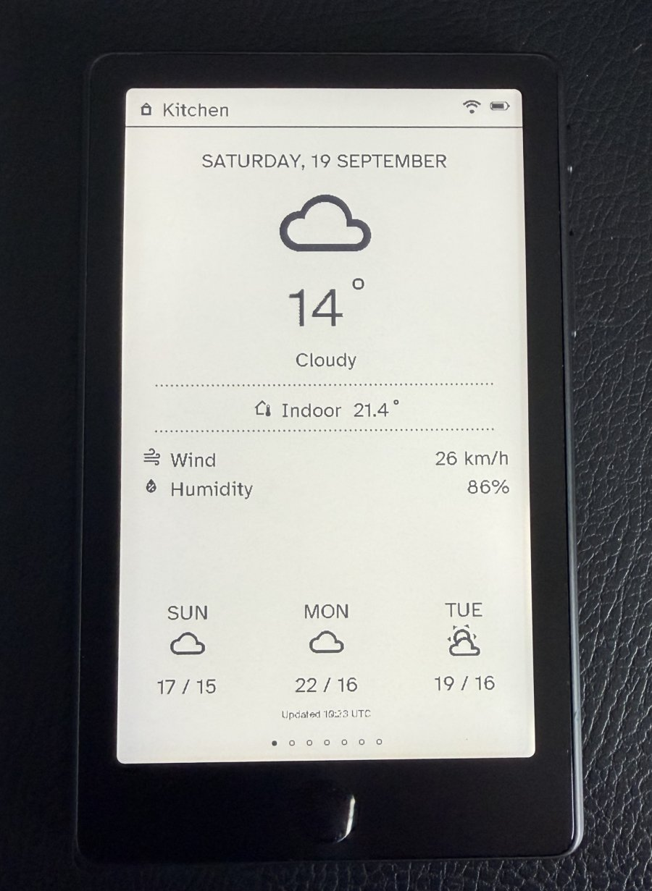

# Switchboard

A smart-home remote for the **Xteink X4 Pro** e-reader. One e-ink panel, four buttons and a touchscreen, driving your lights, blinds, music, TV and climate through Home Assistant — no app, no phone, just pick it up off the wall dock and tap.

**[⚡ Flash it from your browser](https://stumarti.github.io/Switchboard/)** — no PlatformIO install needed (Chrome/Edge on desktop only).

## Gallery

<table>
<tr>
  <td> Standby</td>
  <td> Lighting</td>
  <td> Climate</td>
</tr>
<tr>
  <td> Blinds</td>
  <td> Music</td>
  <td> TV</td>
</tr>
<tr>
  <td> Jump to menu</td>
</tr>
</table>

## What you need

- An **Xteink X4 Pro**.
- A **Home Assistant** instance on your network.
- **[Switchboard Server](https://github.com/stumarti/Switchboard-Server)** running somewhere on your LAN (a Docker container — a spare mini PC, NAS, or Unraid box all work). This is what tells your remote which lights/blinds/TV etc. actually exist in the room it's in — the firmware doesn't know anything about your house on its own.

## Quick start

1. **Get Switchboard Server running first.** Follow its [README](https://github.com/stumarti/Switchboard-Server) — it's a couple of minutes with `docker compose up -d`. Set an admin password on first open, then create at least one room (e.g. "Kitchen") and fill in its Home Assistant entities before moving on.
2. **Flash the device.** Plug the X4 Pro into your computer over USB and use the [browser flasher](https://stumarti.github.io/Switchboard/) (Chrome or Edge on desktop). Prefer to build it yourself? See [Building from source](wiki/Building-from-Source.md).
3. **First boot.** The device shows a splash, then walks you through joining your Wi-Fi (pick your network, type the password on the on-screen keyboard).
4. **Pair with the server.** The device registers itself and asks you to approve it. Open Switchboard Server's **Remotes** page, approve it there (optionally picking its room in the same step), then **press any button on the remote** to continue.
5. **(Optional) Pick a different room later**, or if you didn't assign one at approval time: tap the **Home** key → **Settings** → **Select room**.

That's it — the carousel now shows whatever you set up for that room on the server. Move the remote to a different room later by repeating step 5; nothing needs re-flashing.

## Using it

- **Left/Right** step through the room's pages: Status, Lighting, Blinds, Music, TV, Receiver, Xbox, Wi-Fi and Climate.
- **Tap Home** for the jump list; **hold Home** for the backlight shade.
- **Settings** (from the jump list) picks the room, shows device info, and holds the timeouts and developer tools.

## Documentation

The in-depth guide lives in the [wiki](wiki/Home.md):

- [Screens](wiki/Screens.md) — every page, the jump list, the shade and Settings
- [Pairing](wiki/Pairing.md) and [Theme](wiki/Theme.md)
- [Updates](wiki/Updates.md) — over-the-air firmware updates
- [Self-test](wiki/Self-Test.md) — the hardware button checker
- [Building from source](wiki/Building-from-Source.md) and [Releases](wiki/Releases.md)

The remote is a client: it doesn't talk to Home Assistant directly and carries no room setup on board. All of that lives in [Switchboard Server](https://github.com/stumarti/Switchboard-Server), which it finds on your network via mDNS (`switchboard.local:45678` by default).
