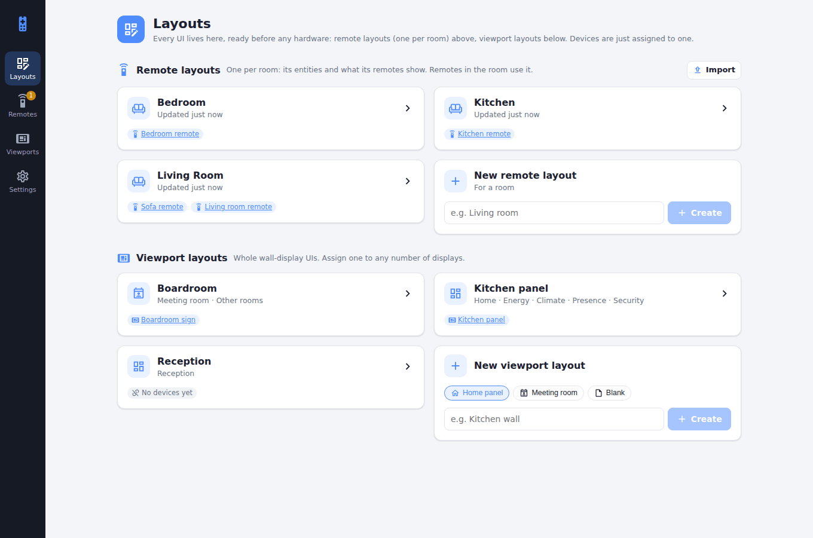

# Try the demo

The server repository comes with a demo: a pretend Home Assistant with a whole house in it, and a Switchboard Server seeded with rooms, remotes, wall displays, weeks of battery history and a firmware release. It needs no hardware and no real Home Assistant.

```sh
git clone https://github.com/stumarti/Switchboard-Server
cd Switchboard-Server
npm install
node tools/demo/demo.js
```

Open `http://localhost:45680` and sign in with the password `demo`. Ctrl-C stops it. Its data goes in a new temporary folder each time, so nothing you change is kept.

## What's in it

| | |
|---|---|
| **Rooms** | Living Room (every page: lights and scenes, blinds, music, TV, Xbox, an Enigma2 receiver, climate, Quick Access), Kitchen and Bedroom |
| **Remotes** | Four, one of them low on battery, plus a new one waiting for approval |
| **Viewports** | A kitchen panel (weather, energy, heating, presence, security), a boardroom sign with a room finder, and a reception screen with company news |
| **Remote updates** | Switched on, with v1.4.0 out to one pilot remote |
| **Home Assistant** | `tools/demo/fake-ha.js`: states, weather forecasts, energy history, calendars, album and box art, and an RSS feed |

<figure class="shot"><figcaption>The demo's Layouts page.</figcaption></figure>

## Settings

| Variable | Default | |
|---|---|---|
| `DEMO_PORT` | `45680` | The admin UI's port. Use `45678` to point the firmware's screenshot tool at it. |
| `FAKE_HA_PORT` | `48123` | The pretend Home Assistant |
| `DEMO_DATA` | a new temp folder | Where the server keeps its data |
| `DEMO_VERBOSE` | unset | Set to `1` to see the server's own log |
