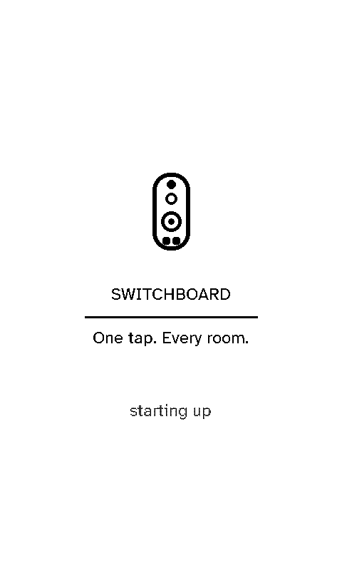
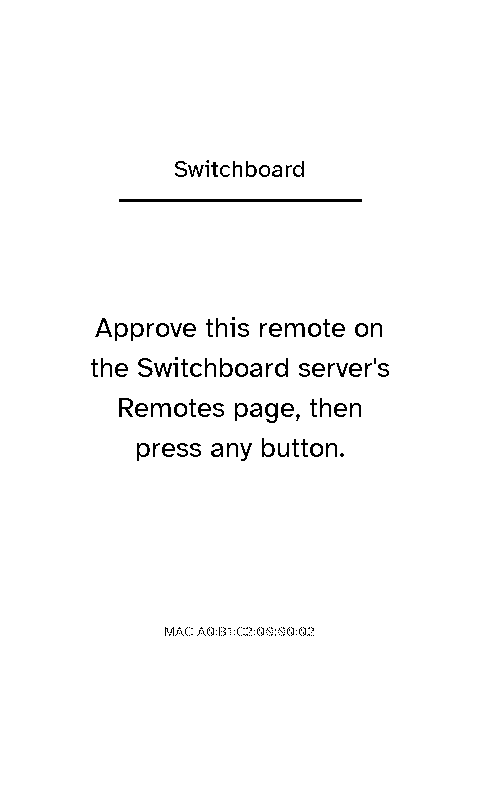
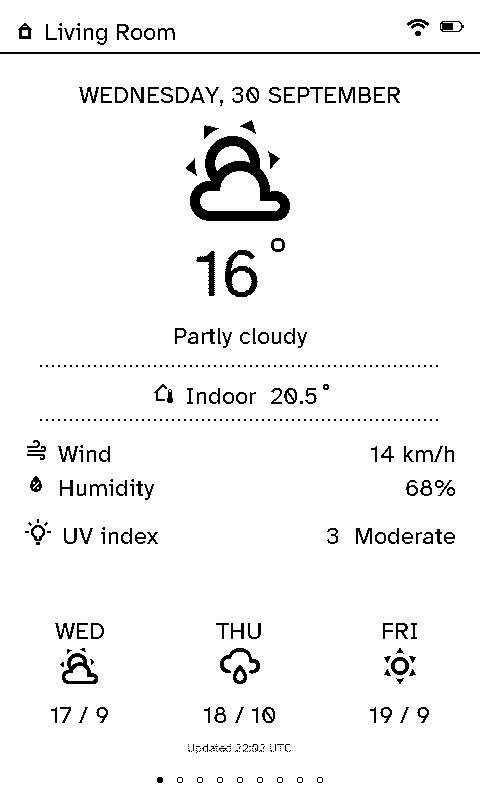

# Getting started

## What you need

- An **Xteink X4 Pro**.
- A **Home Assistant** instance on your network, and a long-lived access token for it (Home Assistant → your profile → Security).
- Somewhere to run **Switchboard Server**, a small Docker container: a spare mini PC, a NAS or an Unraid box all work.

## 1. Run the server

```yaml
services:
  switchboard-server:
    image: ghcr.io/stumarti/switchboard-server:latest
    container_name: switchboard-server
    network_mode: host   # required: remotes find the server by mDNS
    environment:
      - PORT=45678
      - MDNS_HOSTNAME=switchboard.local
    volumes:
      - ./data:/data
    restart: unless-stopped
```

```sh
mkdir -p data
docker compose up -d
```

This file is `docker-compose.yml` in the server repository. On Unraid, use its `unraid-template.xml` instead (see [Configuration](server/configuration.md)).

## 2. Set it up

1. Open `http://<your-server-ip>:45678` and set an admin password.
2. **Settings → Home Assistant:** enter its address and token, save, then press **Test**.
3. **Settings → Wi-Fi networks:** the network remotes should join, and any guest networks to show as QR codes.
4. **Layouts:** create a room and fill in its Home Assistant entities. Entity fields search Home Assistant as you type.

<figure class="shot"><figcaption>Settings → Home Assistant, connected.</figcaption></figure>

## 3. Flash the remote

Plug the X4 Pro into your computer over USB and use the [browser flasher](../) (Chrome or Edge on a desktop). If you'd rather build it yourself, see [Building the firmware](remote/building.md).

## 4. Join Wi-Fi and pair

1. On first boot the remote shows a splash, then walks you through joining Wi-Fi: pick your network, and type the password on the on-screen keyboard.
2. It registers with the server and asks to be approved.
3. On the server's **Remotes** page, approve it, choosing its room in the same step.
4. Press any button on the remote.

<div class="shots">
  <figure><div class="remote"></div><figcaption>Starting up</figcaption></figure>
  <figure><div class="remote"></div><figcaption>Waiting to be approved</figcaption></figure>
  <figure><div class="remote"></div><figcaption>Paired: the room's Status page</figcaption></figure>
</div>

<figure class="shot"><figcaption>Approving a new device on the server: as a remote (choose its room) or as a viewport (choose its layout).</figcaption></figure>

That's it. The remote now shows whatever you set up for its room. Move it to another room later from **Settings → Select room** on the remote, or on its page on the server; nothing needs re-flashing.
