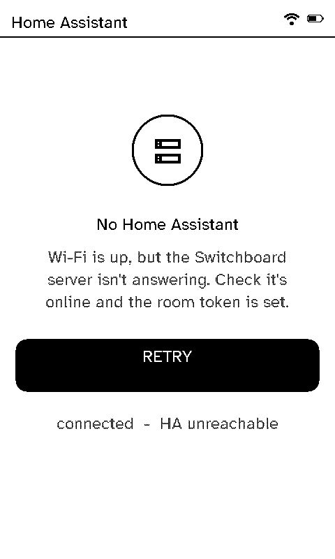
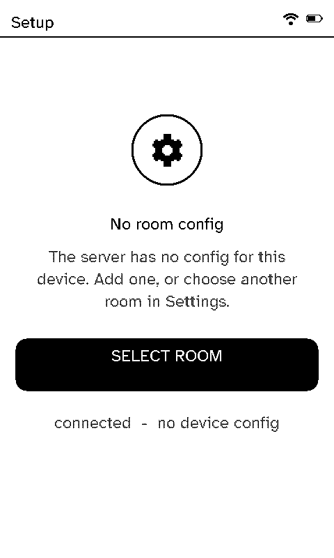
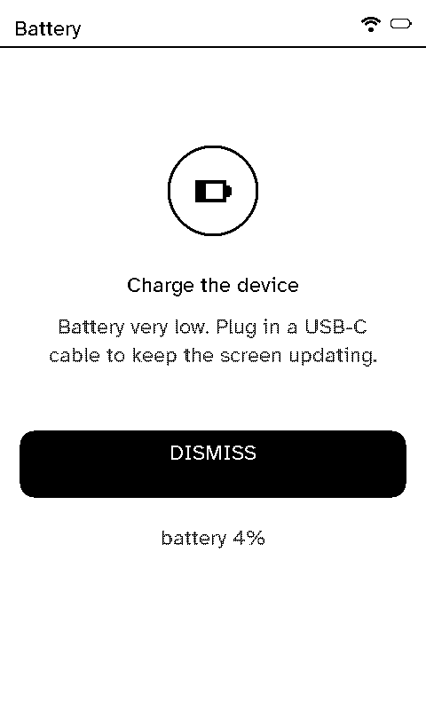

# When something's wrong

If the server or Home Assistant can't be reached, the remote shows a plain screen saying so instead of hanging. Any button tries again, and Home still opens Settings.

  <figure>

<figcaption>The server isn't answering</figcaption></figure>
  <figure>

<figcaption>No room for this remote</figcaption></figure>
  <figure>

<figcaption>Battery very low</figcaption></figure>

| Screen | What to do |
|---|---|
| **No Home Assistant** | Check the server is running, and that its Home Assistant connection works (**Settings → Home Assistant → Test** on the server). |
| **No room config** | The server has no room for this remote: assign one on its page on the server, or pick one here with **Select room**. |
| **Charge the device** | Plug in a USB-C cable. The server's Home page warns before it gets this far (see [Battery life](../server/battery-life.md)). |

**Settings → Developer → Error states** previews every one of these, to check how they look.
