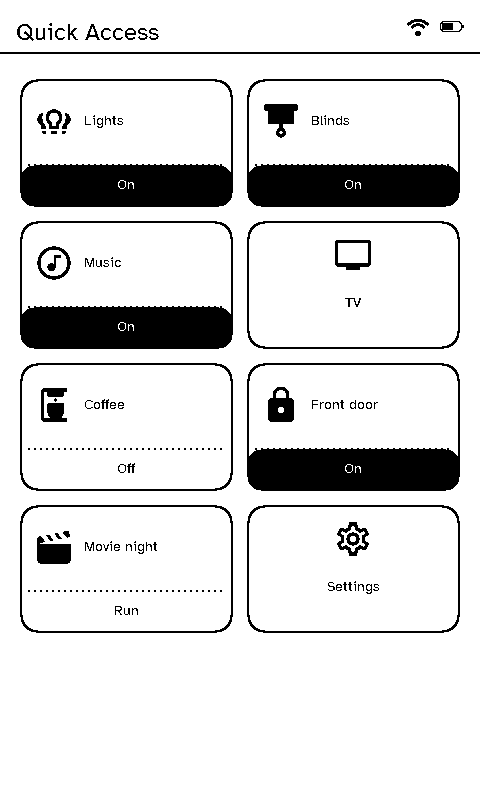
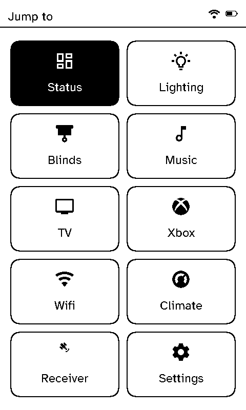
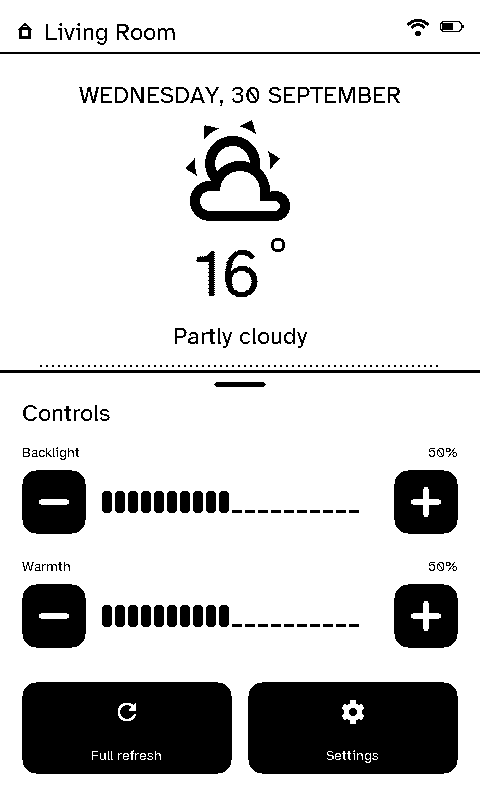

# Quick Access and the shade

Two things are a press of the **Home** key (the touch key below the screen) away from any carousel page.

## Tap Home: Quick Access

  <figure>

<figcaption>A room's Quick Access buttons</figcaption></figure>
  <figure>

<figcaption>Without them: Jump to</figcaption></figure>

If the room has **Quick Access** buttons (set on the server's [remote layouts](../server/remote-layouts.md)), tapping Home shows them, up to ten a page. Each button's top part opens a page. Its bottom strip, if it has one, does something straight away:

- **Toggle:** switches an entity, and shows whether it's on. It understands what "on" means for each kind: an open cover or valve, a locked lock, a cleaning vacuum, a playing speaker.
- **Run:** calls a Home Assistant service, such as a scene or a script.

The strips can be switched off on the remote in **Settings → Developer → Quick actions**, leaving just the page buttons.

A room without Quick Access buttons gets **Jump to** instead: a grid of every page it shows, plus Settings, to go straight to one instead of stepping through the carousel.

## Hold Home: the shade

  <figure>

<figcaption>The shade</figcaption></figure>

The **shade** slides up over the page with the screen's backlight brightness and warmth, a button for a full (clean) refresh of the e-ink panel, and one for Settings.
