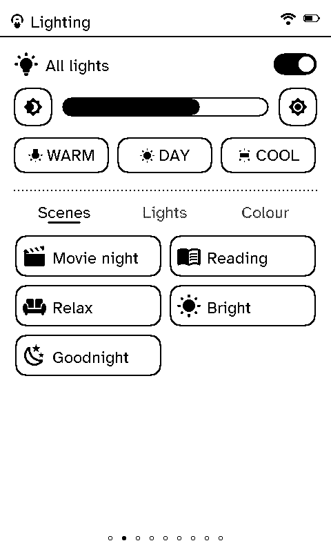
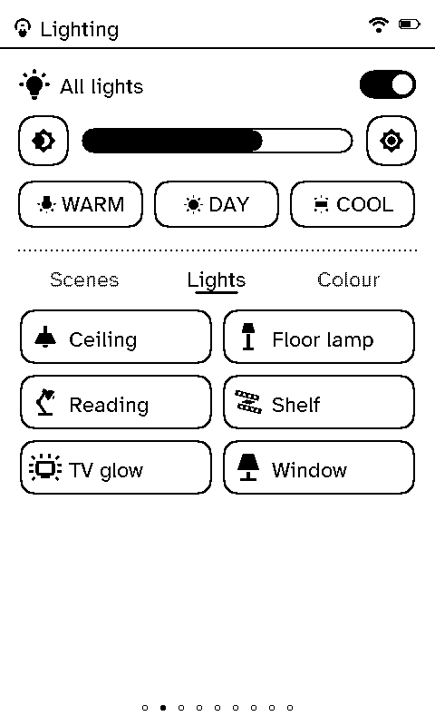
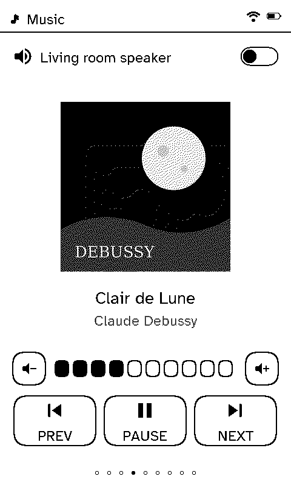
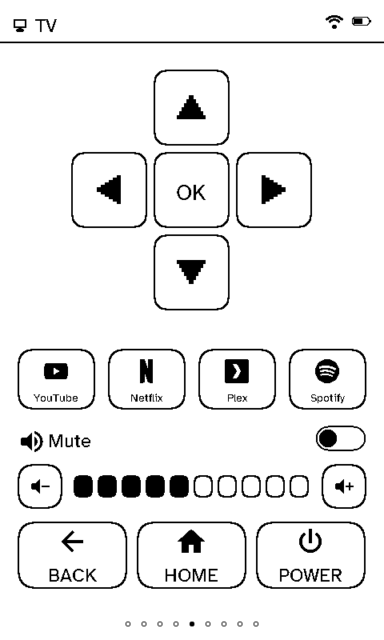
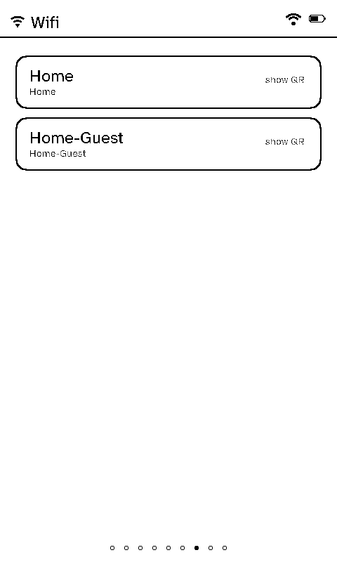

# Screens

The remote's home is the **carousel**: Left and Right step through whichever of these pages its room has turned on, in the order set on the server ([remote layouts](../server/remote-layouts.md)). Each page's icon runs along the bottom, the one you're on underlined, as on a viewport (a theme's carousel icons replace them).

## Status

  <figure>

<figcaption>Status</figcaption></figure>
  <figure class="photo"><figcaption>The same page on the panel</figcaption></figure>

The default page, and what the remote shows sitting on its dock: the date, the weather now, the indoor temperature, wind, humidity and UV, and a three-day forecast. The line at the bottom says when the data last changed (in UTC).

## Lighting

  <figure>

<figcaption>Scenes</figcaption></figure>
  <figure>

<figcaption>Lights</figcaption></figure>
  <figure>

<figcaption>Colour</figcaption></figure>

At the top, the room's light group: on/off, a brightness bar with − and +, and Warm, Day and Cool presets. Below, three tabs:

- **Scenes:** one tap runs a Home Assistant scene.
- **Lights:** each light on its own; the icon shows whether it's on.
- **Colour:** colours and effects for the group, when the group supports them (set on the server). More than a page of them pages with Left and Right.

## Blinds

  <figure>

<figcaption>Blinds</figcaption></figure>

Up, Stop and Down for the whole room, and a row for each blind or cover. Stop on a blind that isn't moving sends it to its favourite position, if it has one.

## Music

  <figure>

<figcaption>Music</figcaption></figure>

What's playing, with its cover (resized and dithered by the server, so the remote never decodes a picture), volume, mute, and Previous, Pause and Next.

## TV

  <figure>

<figcaption>TV</figcaption></figure>

A D-pad with OK, up to four app buttons (each with its own icon if one is picked on the server), volume and mute, and Back, Home and Power.

## Xbox

  <figure>

<figcaption>Xbox</figcaption></figure>

What's being played, with its art, the console's power, and a library to launch from: a list set on the server, or the console's own library, which the server reads from Home Assistant (up to 36 games).

## Receiver

  <figure>

<figcaption>Receiver</figcaption></figure>

An Enigma2 satellite or cable box (Vu+, Dreambox, …) through Home Assistant's Enigma2 integration: the channel and programme on now (and next), up to six favourite channels, volume, mute, channel up and down, and power. With the box's own address on the server, the page also shows the programme on next and each channel's picon. Off until it's switched on for the room.

## Wi-Fi

  <figure>

<figcaption>The networks</figcaption></figure>
  <figure>

<figcaption>A guest scans the code</figcaption></figure>

The household's Wi-Fi networks (set in the server's [settings](../server/settings.md)). Tap one for a QR code a phone can scan to join, so nobody has to read out a password.

## Climate

  <figure>

<figcaption>Climate</figcaption></figure>

A thermostat dial: the target temperature (− and + in the thermostat's own steps), the temperature now, and the mode (Off, Heat, Auto). Below, any other temperature sensors added for the room.

## Live and resting pages

Most pages show what the last refresh brought and wait for a press. Music and Xbox are **live** while something plays, but only while that page is on screen and Wi-Fi is already up: the remote holds one request open on the server, which answers the moment the track or game changes. A new track repaints in full with its art; a pause or a volume change is a quick partial repaint. The Wi-Fi timeout (Settings → Timeouts) still turns the radio off on time, which ends the watch.

## Refreshes

The remote wakes on a timer to refresh, as often as its room (or the remote itself) says on the server. With **On the clock** switched on there, a 15, 30 or 60 minute refresh lands on the clock: every 30 minutes means on the hour and at half past. Each remote is a few seconds after the last, so they don't all reach the server at once.
