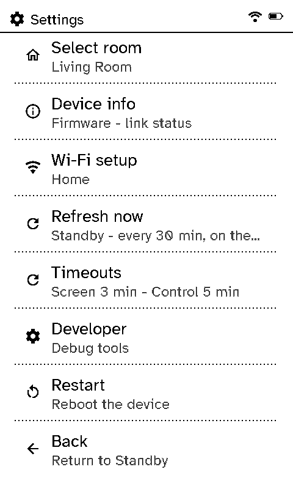
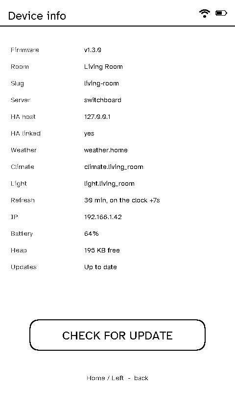
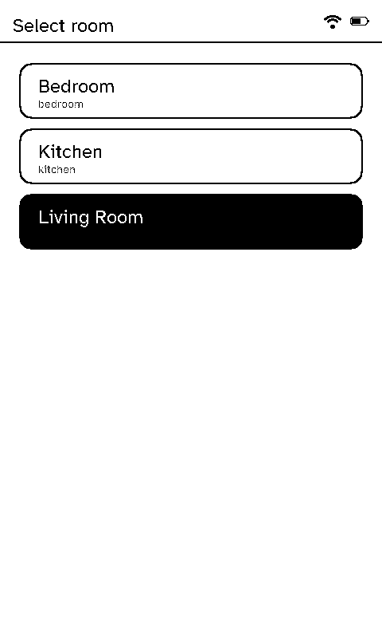
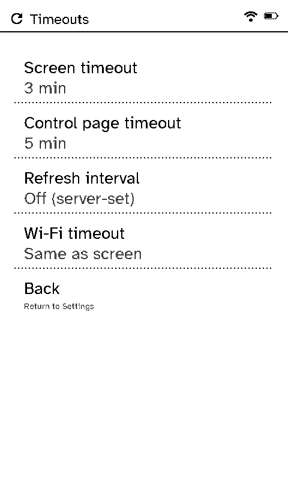
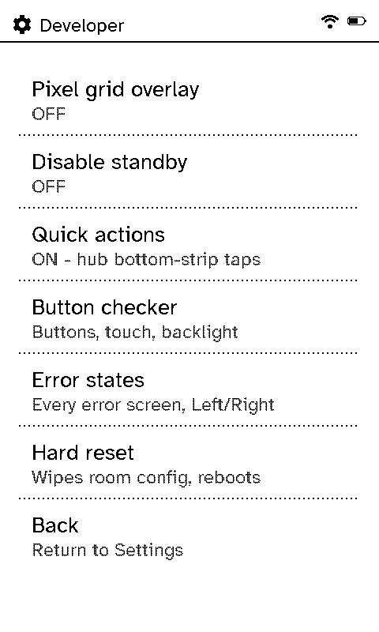

# Settings

Open Settings from Quick Access (or Jump to), or the shade's cog.

  <figure>

<figcaption>Settings</figcaption></figure>
  <figure>

<figcaption>Device info</figcaption></figure>
  <figure>

<figcaption>Select room</figcaption></figure>
  <figure>

<figcaption>Timeouts</figcaption></figure>
  <figure>

<figcaption>Developer</figcaption></figure>

- **Select room:** which room's layout this remote uses. A room picked here wins over the one the server assigned.
- **Device info:** firmware version, room, server and Home Assistant, refresh schedule, Wi-Fi address, battery and updates, with **Check for update** when the server allows it (see [Updates](updates.md)).
- **Wi-Fi setup:** forget the network and join another.
- **Refresh now:** pull everything from the server straight away.
- **Timeouts:** how long before the screen sleeps, how long a control page stays up before going back to Status, how often it refreshes, and how long the Wi-Fi radio stays on while idle (by default, as long as the screen; the next press reconnects).
- **Developer:** a pixel grid overlay, a switch to stop it sleeping, the Quick Access strips on or off, the hardware button checker, a preview of every error screen, and a hard reset that clears the picked room (useful if a bad room setup ever gets a remote stuck).
- **Restart.**

## The hardware button checker

**Developer → Button checker** confirms every input works on a newly built or flashed remote: it ticks off Left, Right, Power and Home as each is pressed, shows where the screen is touched, steps the backlight and warmth, and runs a full refresh on demand. Hold Home to start it again.
