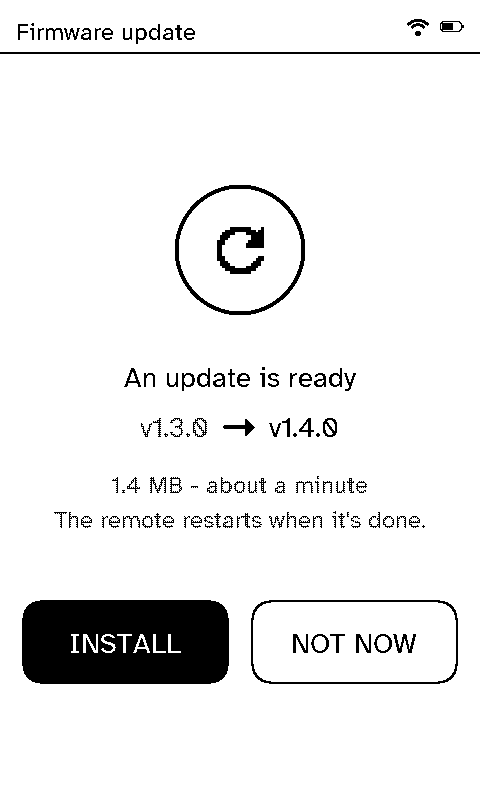
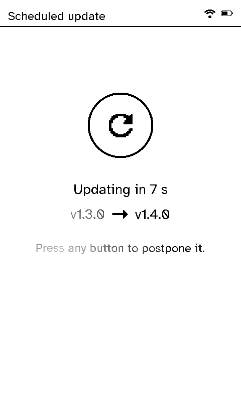
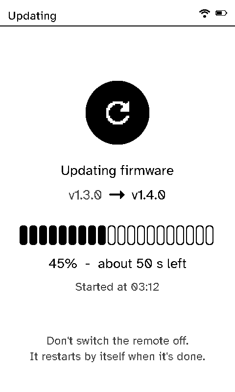
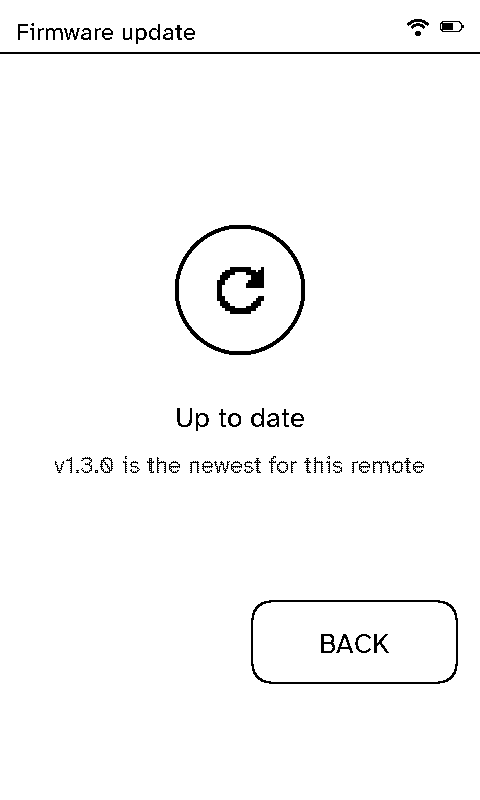

# Updates

Remotes can update their firmware over Wi-Fi from the server. It's off until it's switched on in the server's **Settings → Remote updates**, and firmware always comes from your own server, never straight from the internet. See [Remote updates](../server/remote-updates.md) for choosing a release, pilot remotes and the schedule.

  <figure>

<figcaption>An update is ready</figcaption></figure>
  <figure>

<figcaption>A scheduled update, counting down</figcaption></figure>
  <figure>

<figcaption>Installing</figcaption></figure>
  <figure>

<figcaption>Nothing to install</figcaption></figure>

## Installing one

- **By button:** **Settings → Device info → Check for update** (unless the server has switched the button off). The remote says it's up to date, or shows the version on offer, its size and about how long it takes, to install now or not.
- **On a schedule:** during the window set on the server, on a normal timer wake. The screen counts down 10 seconds first; press any button to put it off.
- **Update now:** after **Update now** on the server's Home page, at the remote's next timer wake, whatever the window. Same countdown.

While it installs, the screen shows the version it's going from and to, a progress bar, the time left and when it started. Then it restarts by itself.

## What keeps it safe

- **Battery:** it won't start below the server's minimum battery (30% by default).
- **Integrity:** the image downloads into the spare app slot, and its SHA-256 is checked before the remote switches to it.
- **The right device:** the image must say it's for this remote's board (`x4pro`); firmware for another kind of device is refused, whatever the server offers.
- **Rollback:** new firmware only counts as good once it reaches the server on its first run. If it restarts or sleeps before that, the remote goes back to the previous firmware by itself.
- **Reporting:** every attempt, good or bad, is reported to the server.
- **Retries:** a scheduled update that fails twice at the same version isn't tried again until a different version is released.

Firmware from before updates existed needs one USB (or [web flasher](../../)) install first.
