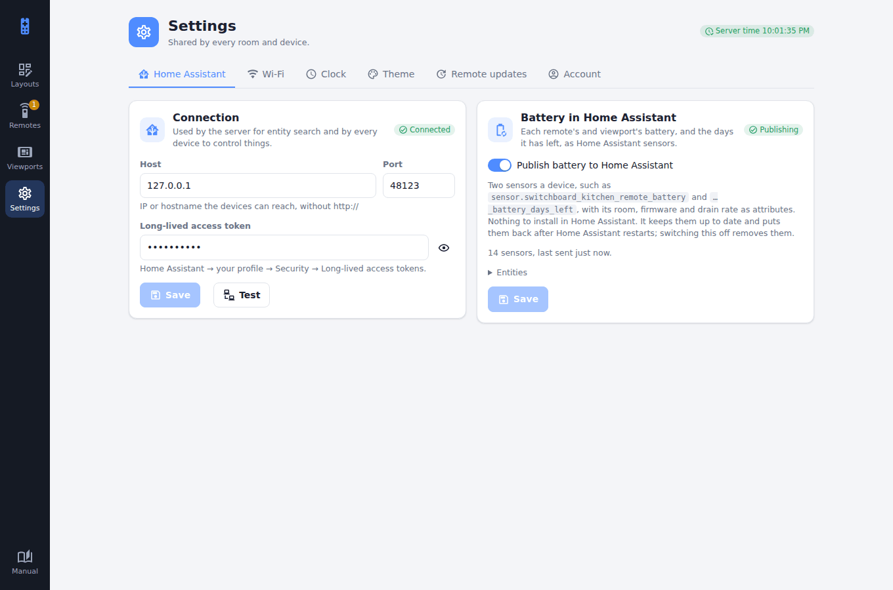

# Battery life

Every device reports its battery on its requests (`X-Battery`), and the server learns from those readings how many days each one has left. No firmware support is needed beyond that header, so remotes and viewports both get it.

## Where it shows

<figure class="shot"><figcaption>The Home page: each battery with the days it has left. The Kitchen remote is low, so it also shows under <b>Needs attention</b>.</figcaption></figure>

- **Home:** each device's battery bar has a "~N days" hint. Hover it for how fast the battery is falling, how long since the last charge, and how long a full charge lasts. A device that's still learning says "learning…".
- **A remote's page:** the battery badge reads, for example, "72% · ~33 days".
- **Needs attention:** Home warns when a device has about 3 days or less left, and the low (20%) and critical (10%) battery warnings say how many days are left.

## How it's worked out

- **History.** Readings are kept at most once every 30 minutes, or whenever the level changes, for 45 days, in `<DATA_DIR>/_battery-history.json` (written at most every 5 minutes, and on shutdown).
- **Charges.** The level jumping up by 3% or more is a charge, and starts a new discharge from the top of the jump.
- **Measured rate.** Once there are 12 hours of readings since the last charge and the level has fallen at least 2%, the drain rate is the least-squares slope of those readings, in % per day. A fuel gauge moves in whole percents, so less than that is noise.
- **Learned rate.** Each discharge of at least 2 days and a 5% drop is folded into a rate learned across charges. Right after a charge, before there's enough new data, that learned rate answers. The more charges a device has been through, the better it knows itself.
- **Days left** = (level − 5%) ÷ rate, counting down from the device's last reading. 5% is about where a remote parks on its charge screen.

A device that barely drains shows no estimate rather than a wildly long one. Removing a device from **Remotes** also deletes its history.

## In Home Assistant

<figure class="shot"><figcaption><b>Settings → Home Assistant</b>, publishing every device's battery.</figcaption></figure>

Switch on **Publish battery to Home Assistant** (Settings → Home Assistant; off by default) and every paired remote and viewport with a battery reading gets two sensors in Home Assistant:

| Sensor | State | |
|---|---|---|
| `sensor.switchboard_<name>_battery` | the battery, in % | `device_class: battery`, so it shows with a battery icon and works in battery cards and alerts |
| `sensor.switchboard_<name>_battery_days_left` | the days left, or `unknown` while it's still learning | `device_class: duration`, in days |

A viewport also gets the readings its own firmware used to send straight to Home Assistant: `sensor.switchboard_<name>_temperature` (°C) and `…_humidity` (%) from its built-in sensor, and `…_voltage` (V, the battery's). If automations used the kitchen panel's old `sensor.dashboard_battery`, `_voltage`, `_temperature` or `_humidity`, point them at these.

`<name>` is the device's name on the server (`Kitchen remote` → `kitchen_remote`); two devices with the same name get the end of their MAC address added. Both sensors carry the device's MAC, type, room (or viewport layout), firmware and last check-in as attributes; the battery sensor also has the drain rate, days since the last charge and whether the estimate is measured or learned.

Use them like any other sensor: an automation that sends a notification when `…_battery_days_left` drops below 2, or a dashboard card of every Switchboard battery.

**How it's done.** The server sets the states through Home Assistant's REST API with the token it already has, so nothing needs installing in Home Assistant (no MQTT broker, no integration). It sends a sensor when its value changes, and every 10 minutes regardless, because Home Assistant forgets states set this way when it restarts. A renamed device's old sensors are removed, as are a removed or revoked device's, and switching publishing off removes them all. Because these sensors have no unique id, they can't be renamed or given an area in Home Assistant's UI; wrap one in a template sensor if you need that.
