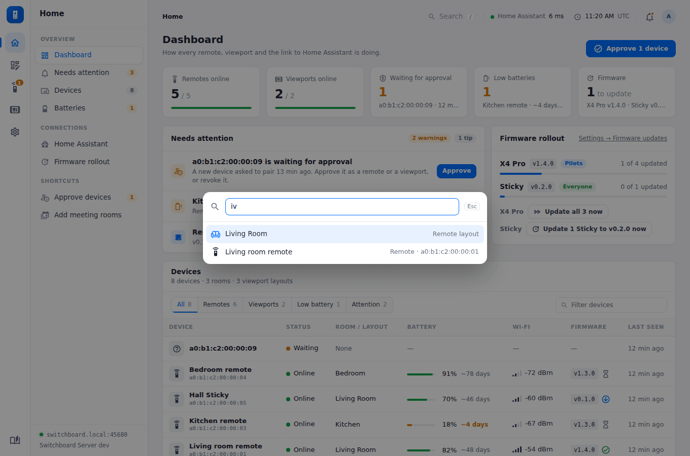
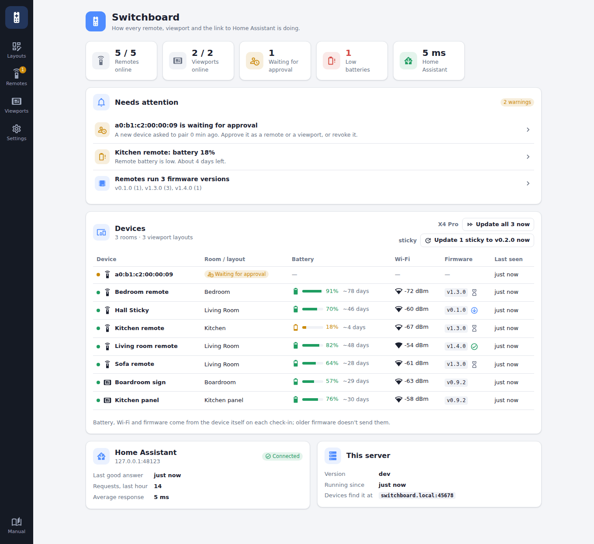

# Home

Open the server at `http://<server>:45678` and sign in.

## Finding your way around

The admin site has three parts, left to right:

- **The rail:** the five sections, **Home**, **Layouts**, **Remotes**, **Viewports** and **Settings**, with the manual at the bottom. A number on Remotes counts devices waiting for approval; one on Home counts critical problems.
- **The section's column:** its own links, stacked. Home's views and shortcuts; every layout, or inside a layout its parts; each remote or viewport; the settings pages, in groups. At the bottom, the address devices find the server at, and its version.
- **The page.** Above it, on the page's background: where you are (click a step to go back to it), **Search**, Home Assistant's response time, the server's time and time zone, a bell for what needs attention, and the account.

<figure class="shot"><figcaption><b>Search</b> (press <kbd>/</kbd> or Ctrl-K anywhere): jump to any page, layout or device by name or MAC address.</figcaption></figure>

## The dashboard

<figure class="shot"><figcaption>Home, in the demo: one remote waiting for approval and one low battery.</figcaption></figure>

Home shows how the whole setup is doing, and what needs attention, worst first.

- **Across the top:** remotes and viewports online, devices waiting for approval, low batteries, and how many devices have firmware to install. Click one to go to it.
- **Needs attention**, each with the button that fixes it (**Approve**, **View**, **Fix**…):
  - critical and low batteries (10% and 20%), and any device with about 3 days or less left ([Battery life](battery-life.md));
  - devices not heard from (a remote in a day, a viewport in three of its refresh intervals), weak Wi-Fi, and devices without a room or layout;
  - remotes on different firmware versions, and failed [updates](remote-updates.md);
  - a newer Switchboard Server, when one is out ([Settings → About](settings.md#about));
  - Home Assistant not set up, unreachable, or failing requests in the last hour (with the recent errors), and any entity a layout names that Home Assistant doesn't have (a typo, or one renamed in Home Assistant).
- **Firmware rollout:** each board's release, whether it's with the pilots or everyone, and how many of its devices have it, with **Update now** buttons. See [Updates](remote-updates.md).
- **Devices:** every device with its status, room or layout, battery and the days it has left, Wi-Fi signal, firmware (an icon shows an update waiting, installed or failed) and when it was last seen. Filter to remotes, viewports, low batteries or devices with a problem, or type part of a name. Click a row to open the device.
- **Home Assistant:** when it last answered, requests in the last hour, the average response, and recent errors.

The column's links jump to each part: **Needs attention**, **Devices**, **Batteries** (the devices table, lowest battery first) and **Home Assistant**.
