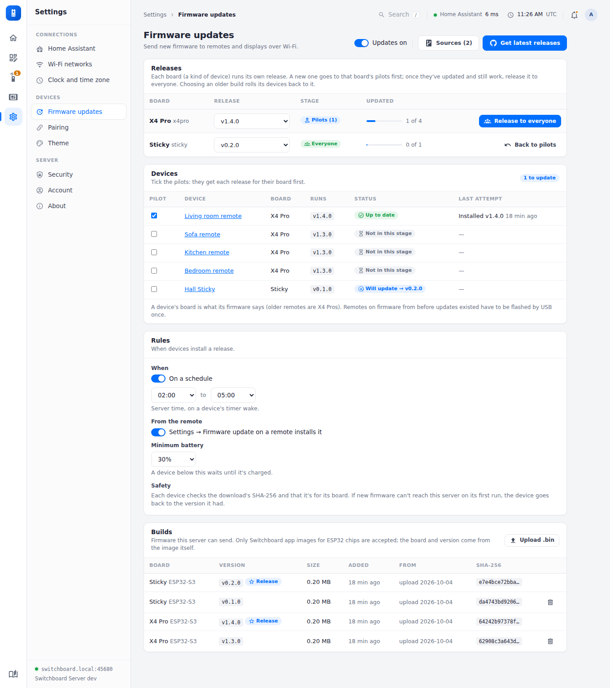
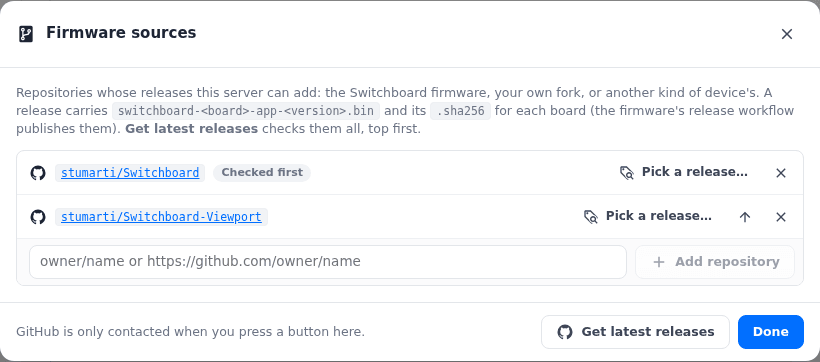

# Updates (over the air)

**Settings → Firmware updates** sends new firmware to remotes and displays, and to any other device that asks, over Wi-Fi. It's **off until you switch it on**.

<figure class="shot"><figcaption><b>Settings → Firmware updates</b>: each board's release, its stage and how many have it; every device's state, and the pilots; the rules; and the builds.</figcaption></figure>

The switch at the top turns updates on and off. Beside it, **Sources** opens the list of GitHub repositories, and **Get latest releases** adds the newest release from each.

## Boards

Every build is for one **board**, a kind of device: `x4pro` is the X4 Pro remote, and firmware for another device picks its own name. The board is written inside the image, and every device says its board when it checks in. So:

- a device is only ever offered a build for its own board, and it checks the download says so too before switching to it;
- each board has its **own release**, pilot stage and **Update now**, so an X4 Pro release never waits on, or reaches, another kind of device;
- the schedule, the button, the minimum battery, the pilot ticks and the repository list are shared.

Builds and remotes from before boards count as `x4pro`.

## Releasing

<figure class="shot"><figcaption><b>Sources</b>: the repositories releases come from. <b>Pick a release…</b> lists one repository's releases to add one.</figcaption></figure>

1. **Add a build**: press **Get latest releases**, pick one release under **Sources → Pick a release…**, or **Upload .bin** a `switchboard-<board>-app-<version>.bin` on the Builds card.
   - The list starts with the Switchboard firmware and [Switchboard Viewport](../viewport/updates.md) (`e1002`). Add others as `owner/name` or their GitHub URL: a fork, or the repository of another kind of device.
   - A release carries `switchboard-<board>-app-<version>.bin` and its `.sha256` for each board it builds (older ones, `switchboard-app-<version>.bin`, are the X4 Pro's). Every image is checked against its published checksum and against the board and version inside it; if any fails, none of the release is added.
   - **Get latest releases** checks every repository in the list, top first; the arrow in **Sources** moves one to the top.
   - Only listed repositories are ever read, and only when you press a button.
   - The server only accepts a Switchboard app image for an ESP32 chip that fits the update slot, and takes the board and version from the image itself. A build from uncommitted changes (`-dirty`) is refused.
2. **Choose each board's release** in the Releases table: the version its devices should run. An older build rolls them back to it. When there's a newer build than the release, the row offers **Send vX to pilots**.
3. **Pilot first**: tick a device or two as pilots in the Devices table. A new release goes only to that board's pilots. When they've updated and still work, press **Release to everyone** for that board.
4. **How devices install it** (the Rules card): from **Settings → Device info → Check for update** on the remote (**From the remote**), and/or **on a schedule**: during a window you set, on a device's normal timer wake.
5. **Update now**: while devices are still due a release, the Home page's **Firmware rollout** card has **Update N remotes to vX now**, one row per board (named when there's more than one). Each of them installs it at its next timer wake (within its refresh interval), whatever the schedule, and even with no schedule set. It keeps to the minimum battery, and to the board's stage: while the release is with the pilots the button updates just them, and **Update all N now (skip pilot)** releases it to everyone in the same step (after asking), so every device of that board not on it installs it at its next wake. A device that tries and fails isn't asked again at every wake; press the button again to retry. **Cancel** takes it back, and choosing another release clears it. Needs remote firmware that knows about it (later than v0.2.3); older remotes keep to the schedule.

On the device:
- **Battery:** it needs the minimum battery set here (30% by default).
- **Integrity:** it downloads into the spare app slot, checks the SHA-256, and checks the image is for its board, before switching.
- **Rollback:** new firmware counts as good only once it reaches this server on its first run. If it can't, the bootloader goes back to the previous firmware by itself.
- **Reporting:** every attempt is reported. Failures show on this page and on the Home page.
- **Retries:** a scheduled update that fails twice at the same version isn't retried until you release another version.

Remotes on firmware from before updates existed need one USB (or web-flasher) install first.

## Firmware for other devices

A device from another repository takes part by doing what the Switchboard firmware does:

| | |
|---|---|
| **Marker** | Embed `SWITCHBOARD_FW:<board>:<version>` (NUL-terminated) in the app image. `<board>` is lower case letters, digits and `-`, up to 24; `<version>` is its release tag. |
| **Check-ins** | Send `X-Board: <board>` and `X-Firmware: <version>` with the device's token (`Authorization: Bearer …`) on its requests to the server. |
| **Offer** | Read the `firmware` block of its config (a remote's `/api/devices/<slug>/bundle`, a viewport's `/api/viewports/me/bundle`), or ask `GET /api/firmware/offer`: `204` for nothing, else `{board, version, size, sha256}`. `now: true` in the block means install at the next wake. |
| **Install** | Download `GET /api/firmware/image/<version>` (only what it's offered), check its size, SHA-256 and marker, and switch only if all three match. Stay rollback-able until the new firmware has reached the server. |
| **Report** | `POST /api/firmware/report` with `{version, from, ok, error, board}` after each attempt. |
| **Releases** | Publish `switchboard-<board>-app-<tag>.bin` and `switchboard-<board>-app-<tag>.bin.sha256` (from `sha256sum`) on each GitHub release, so this server can add them. |

Then add its repository under **Sources**. Its builds show under its own board, and its devices under Devices.

## Where builds are kept

Builds live on this server, in `<DATA_DIR>/firmware/` as `<board>-<version>.bin` (with `firmware.json` recording each one's board, version, chip, size, checksum and source). Devices only ever download from here; GitHub is read only when you press a button to add a release.

See [Security](security.md) for what turning this on means, and the remote's [Updates](../remote/updates.md) page for what a remote shows while it updates.
