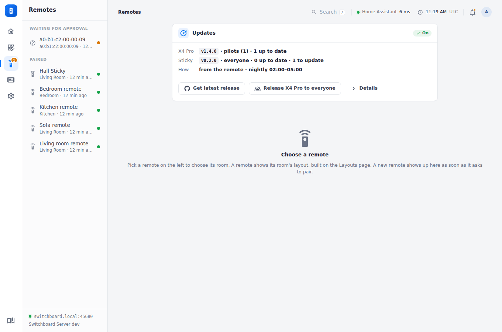
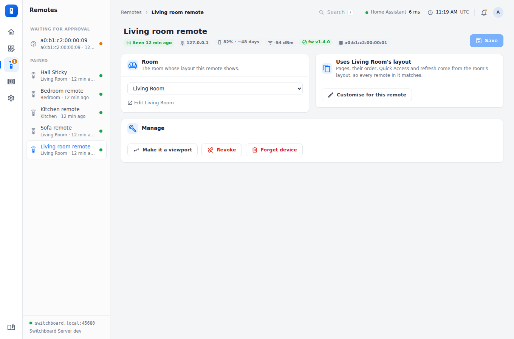
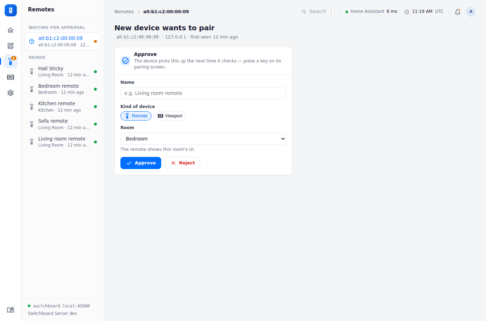

# Remotes

**Remotes** lists every handheld remote in its column, with its room and when it was last seen; the dot beside it is green while it's online. Devices waiting for approval are at the top.

<figure class="shot"><figcaption><b>Remotes</b>, with none picked: the list, and the summary of <a href="remote-updates.html">remote updates</a>.</figcaption></figure>

## A remote's page

<figure class="shot"><figcaption>One remote: when it was last seen, its address, battery and days left, Wi-Fi, firmware (and any update), its room, and managing it.</figcaption></figure>

- **Room:** which room's layout it uses. **Customise for this remote** gives it its own pages (the same list as a [remote layout's](remote-layouts.md#the-pages): drag to reorder, switch off to skip), Quick Access and refresh, starting from the room's, without changing the room. **Use the room's layout instead** goes back.
- **Manage:** make it a viewport instead, **Revoke** it (its token stops working at once; it has to be approved again), or **Forget** it (the record, and its [battery history](battery-life.md), are deleted).

## Approving a new one

<figure class="shot"><figcaption>A new device, waiting for approval.</figcaption></figure>

A new device appears at the top as soon as it asks to pair. Approve it as a **remote**, choosing its room, or as a **viewport**, choosing its layout. See [Pairing & auth](pairing-and-auth.md).
