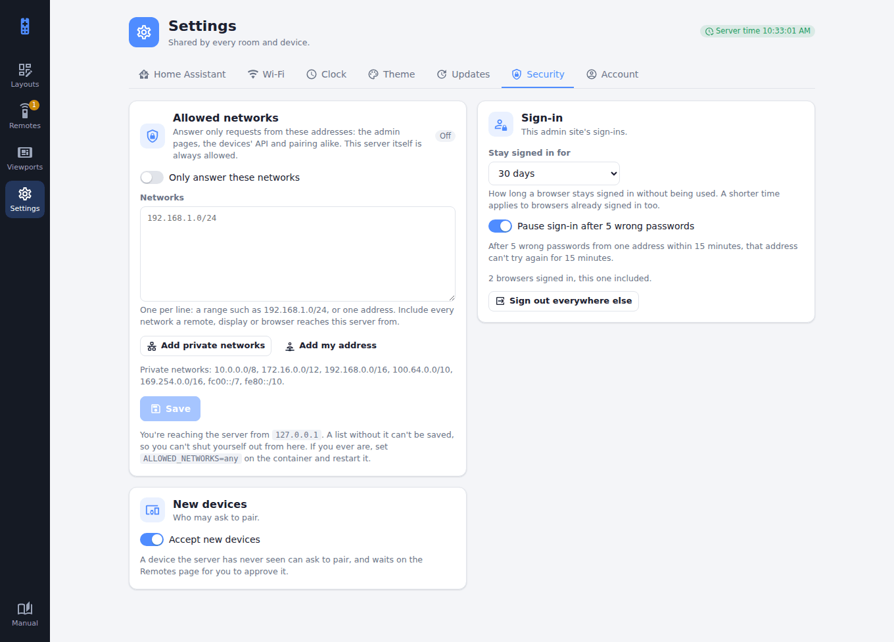

# Security

Plain HTTP, LAN-only by design — same trust model as the on-device config form it replaces, now with a login gate on the admin UI and per-device pairing tokens instead of the previous no-auth-at-all posture (see [Pairing & auth](pairing-and-auth.md)). This server still holds *every* room's Home Assistant token plus your WiFi password in one place, so: keep it off the internet, don't port-forward it, and treat it like any other credential store on your network.

With **Updates** on, this server can also install firmware on every remote. Keep the admin password strong. Treat the server as able to change what every remote runs, and anyone on your LAN as able to see its plain-HTTP traffic. Firmware is checked against a SHA-256 the same server provides, so this guards against corruption, not against a compromised server or network.

## Settings → Security

<figure class="shot"><figcaption><b>Settings → Security</b>.</figcaption></figure>

### Allowed networks

Off until you switch it on. On, the server answers only requests from the networks listed: the admin pages, the devices' API and pairing alike. Anything else gets `403 Not allowed from this network`, and nothing more.

- **What to list:** ranges such as `192.168.1.0/24`, or single addresses, one per line. **Add private networks** fills in every private range (home and office networks, Tailscale's `100.64.0.0/10`, and IPv6's local ranges). Include every network a remote, display or browser reaches the server from.
- **This server itself** (`127.0.0.1`, `::1`) is always allowed.
- **You can't shut yourself out from here:** a list that doesn't include the address you're saving from is refused. The tab shows the address you're seen from.
- **Whose address:** the connection's own. An `X-Forwarded-For` header is ignored, since anyone can send one. Behind a reverse proxy, every request comes from the proxy: set `TRUST_PROXY` to the proxy's address and the address it forwards is checked instead (see [Configuration](configuration.md)).
- **Locked out anyway?** `ALLOWED_NETWORKS` on the container replaces the list while it's set: `ALLOWED_NETWORKS=any` turns it off, or give it the ranges to allow. Restart the container to apply it.

### Sign-in

- **Stay signed in for:** how long a browser stays signed in without being used: 1 hour, 8 hours, 1 day, 7 days or 30 days (the default). A shorter time applies to browsers already signed in too.
- **Pause sign-in after 5 wrong passwords**, on by default: after 5 wrong passwords from one address within 15 minutes, that address can't try again for 15 minutes. Other addresses aren't affected.
- **Sign out everywhere else:** signs out every other browser, and shows how many are signed in. Changing the password does this too.

### New devices

**Accept new devices**, on by default. Off, a device the server has never seen can't ask to pair, so nothing new turns up on the Remotes page. Devices it already knows keep working, and can get a new token after a reset. Switch it on while you add a device.

## Locking down releases

- Pin the image to a version (`ghcr.io/stumarti/switchboard-server:1.0.0`) instead of `:latest` if you'd rather choose when the server updates.
- Protect `main` (pull requests, passing CI) and restrict who can push `v*` tags, since a tag publishes an image.
- Keep two-factor authentication on the GitHub account.
