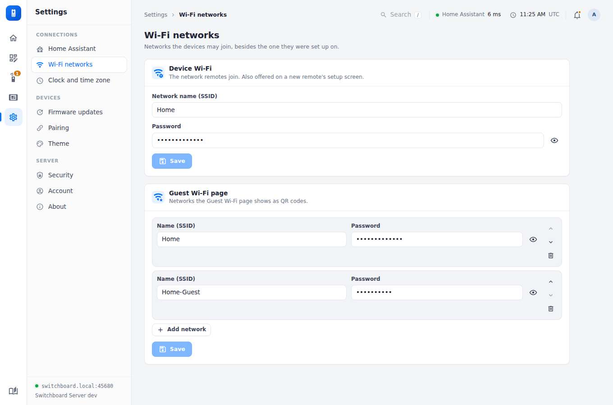
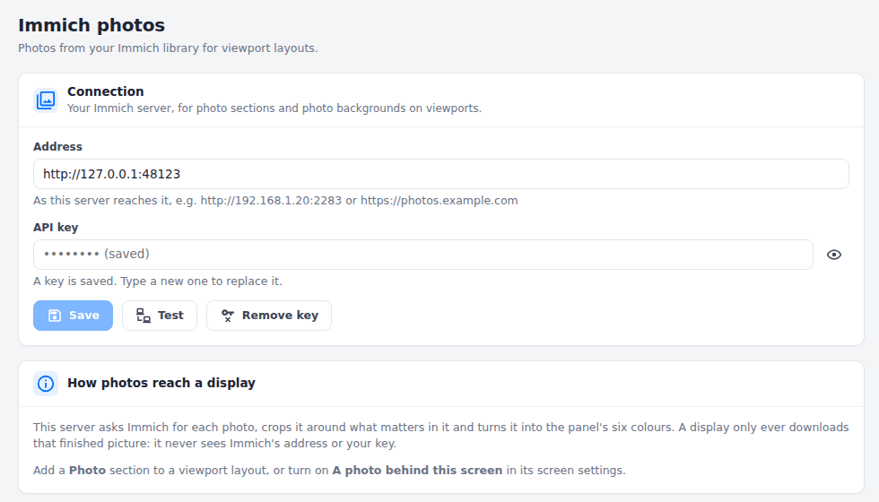
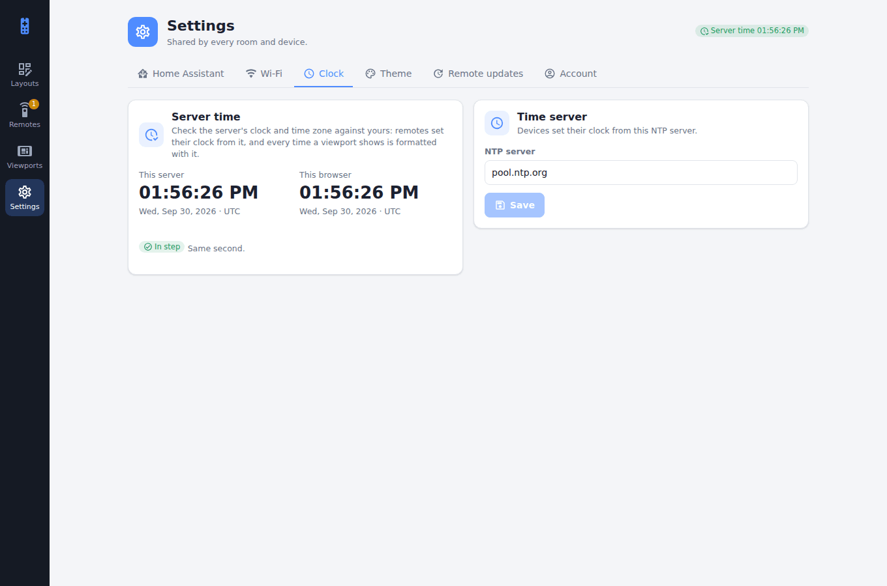
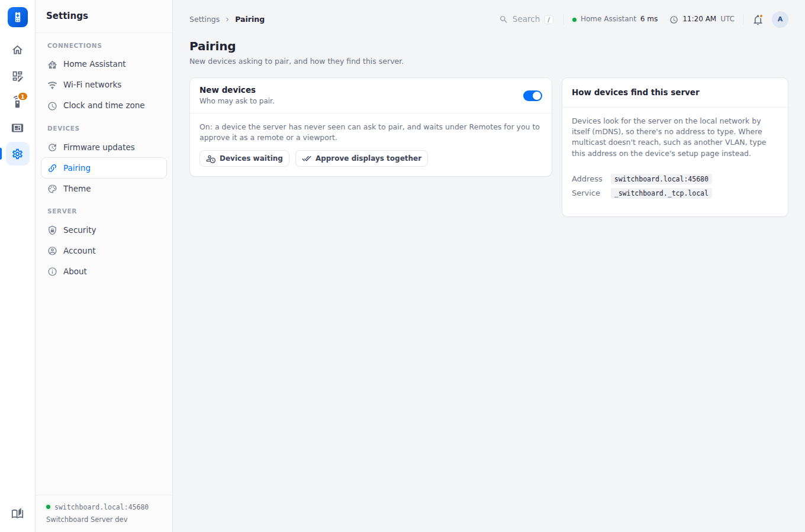
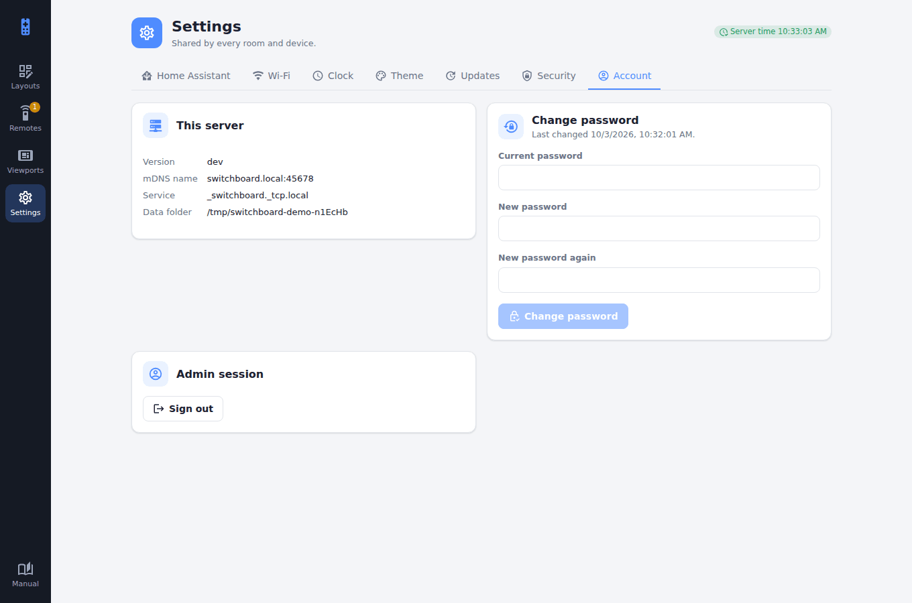
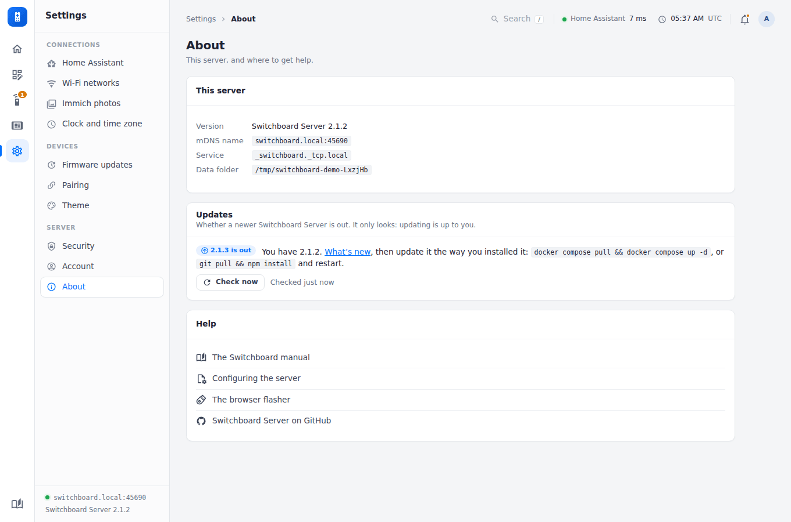

# Settings

Settings are shared by every room and device. Their pages are listed down the Settings column in three groups:

| Group | Pages |
|---|---|
| **Connections** | Home Assistant, Wi-Fi networks, Immich photos, Clock and time zone |
| **Devices** | Firmware updates, Pairing, Theme |
| **Server** | Security, Account, About |

The server's time and time zone are always shown at the top of the page; click them for the Clock page.

## Home Assistant

<figure class="shot"><figcaption>The connection every room uses, with a test.</figcaption></figure>

The address, port and long-lived access token the server uses to reach Home Assistant. The server fetches Home Assistant's state for every device; a remote only asks Home Assistant itself when the server can't reach it.

The same page can **publish every device's battery to Home Assistant** as sensors, off by default. See [Battery life](battery-life.md#in-home-assistant).

## Wi-Fi networks

<figure class="shot"><figcaption>The network remotes join, and the networks they show as QR codes.</figcaption></figure>

The network remotes join, and the household's networks, which the remote's [Wi-Fi page](../remote/screens.md#wi-fi) shows as join-QR codes for guests.

## Immich photos

<figure class="shot"><figcaption>Your Immich server's address and an API key.</figcaption></figure>

Your [Immich](https://immich.app) server, for photo sections and photo backgrounds on viewports. The key stays on the server and is never shown again once saved. See [Photos from Immich](../viewport/photos.md).

## Clock and time zone

<figure class="shot"><figcaption>The time server, and whether the server's clock agrees with your browser's.</figcaption></figure>

Remotes set their clock from the server, so this page says if the server's clock drifts or its time zone differs from your browser's. It also sets the NTP server devices use.

**Time zone.** Every time a remote or viewport shows (clocks, calendars, meetings, quiet hours) is in the server's time zone. Leave it on **Automatic** and the server takes Home Assistant's, re-checked hourly. Without Home Assistant (meeting-room signs on calendar links, for example), choose it here: a container is otherwise on UTC, and the Home page warns that times are shown in it. `TZ` in the server's environment wins over this setting. A change takes effect at once, and on each display at its next refresh.

## Firmware updates and Theme

See [Updates](remote-updates.md) and [Theme](theme.md).

## Pairing

<figure class="shot"><figcaption>Whether new devices may ask to pair, and the address devices find the server at.</figcaption></figure>

**New devices** says whether a device the server has never seen may ask to pair (see [Security](security.md#new-devices)). The page also shows the address and service devices find the server by. Where multicast doesn't reach, such as another VLAN, type that address on the device's setup page.

## Security

<figure class="shot"><figcaption>Allowed networks, and sign-in.</figcaption></figure>

Which networks the server answers, and how sign-in is protected. See [Security](security.md).

## Account

<figure class="shot"><figcaption>Changing the admin password, and signing out.</figcaption></figure>

Change the admin password. If `ADMIN_PASSWORD` is set on the container, it replaces the password on every restart (see [Pairing & auth](pairing-and-auth.md)).

## About

<figure class="shot"><figcaption>This server's version, address and data folder, whether a newer version is out, and where to get help.</figcaption></figure>

**Updates** says whether a newer Switchboard Server is out. The server asks GitHub for the latest release a minute after it starts and then twice a day; **Check now** asks again. When there's a newer one, it links to the release notes and it's on the Home page's **Needs attention** too. It only looks: update the way you installed it (`docker compose pull && docker compose up -d`, or `git pull && npm install` and restart). A development build (no version set) can't tell whether it's behind, so it never says so. To stop it asking, set `DISABLE_UPDATE_CHECK=1` ([Configuration](configuration.md)).
