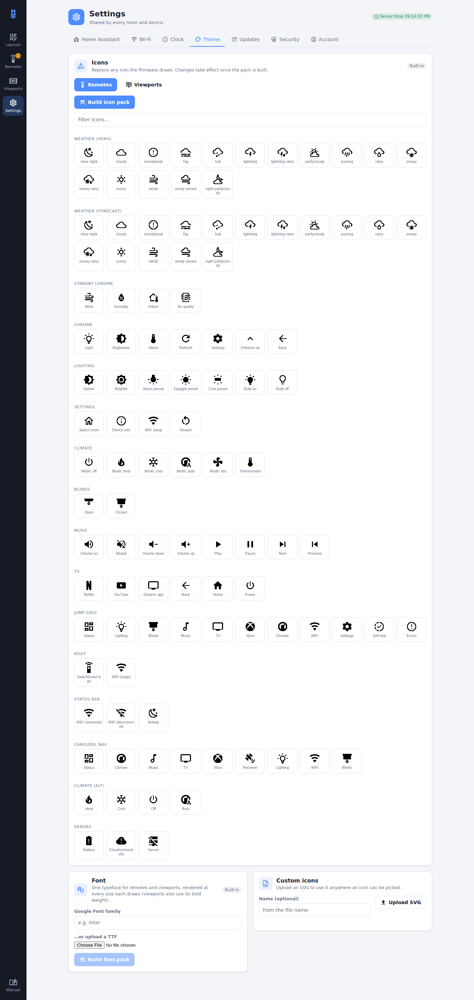

# Theme

The **Theme** page compiles the firmware's on-screen look — one font (upload a TTF/OTF, or name a Google Font) and any of its ~107 named icons (search Material Design Icons and assign a replacement per slot) — into two binary files every paired remote downloads automatically and loads from its SD card at runtime. Publishing recompiles and takes effect on every device's next check-in; nothing needs reflashing. An unmodified icon slot keeps its original look.

Remotes and viewports draw different icons, so **Icons** has a set for each (**Remotes** / **Viewports**), each built into its own pack; a device downloads its own kind's. The font is shared: viewports draw it at their four sizes, in its regular and bold weights (a Google Font's 700, or an uploaded bold file). A viewport's pack holds only the slots you've changed, so its built-in colour art (the weather icons and the solar panel) stays in colour until you replace it; replacements are one colour. See [Viewport screens](../viewport/screens.md#colour-icons).

<figure class="shot"><figcaption><b>Settings → Theme</b>: every icon the firmware draws, each replaceable.</figcaption></figure>
