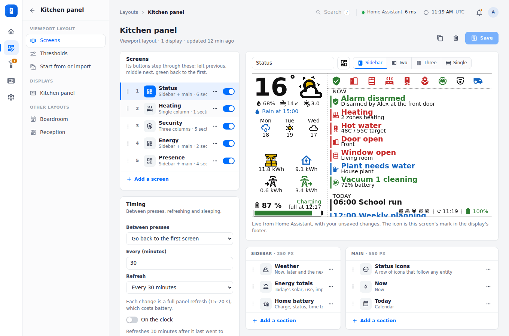
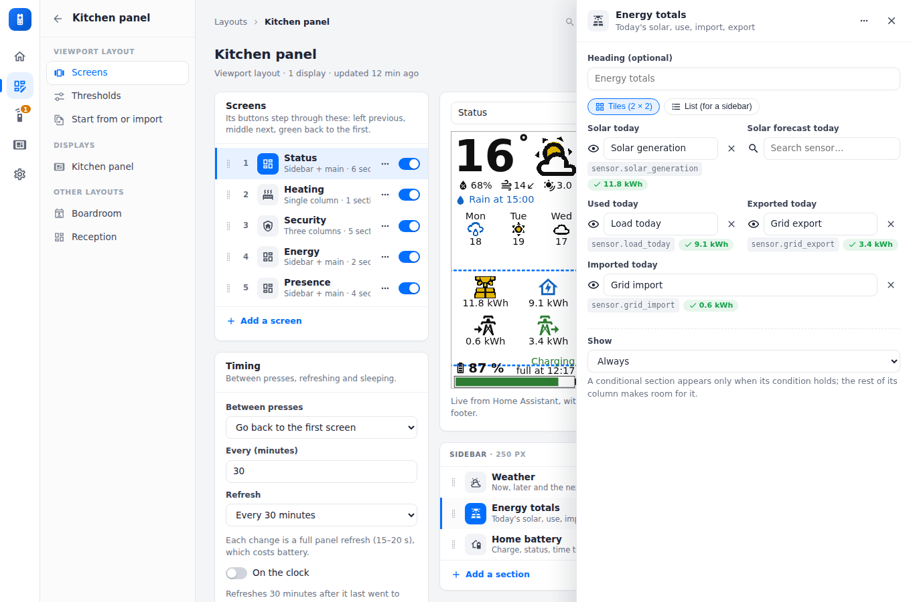
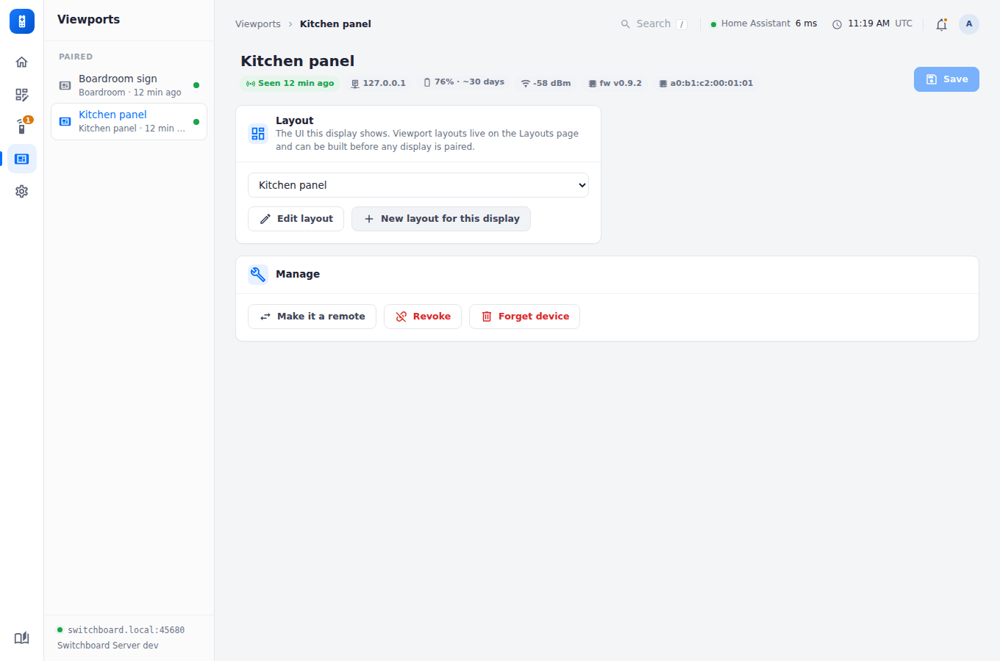

# Viewports

A viewport is a colour wall-mounted e-ink display, for example the reTerminal E1002 kitchen panel or a sign beside a meeting room door, running [Switchboard Viewport](../viewport/setup.md). It pairs like a remote but registers as `"type": "viewport"`. The device only draws. Its whole UI is a **viewport layout** (a "dashboard" in the API and data folder). It's built on the Layouts page, before or after any display exists, and assigned to one or more displays on their Viewports page. A display without a layout shows "not set up". Viewports saved before layouts were separate move into a layout of their own automatically at startup.

<figure class="shot"><figcaption>The kitchen panel's layout in the builder: its screens and timing on the left; the picked screen's name, icon and template above its live preview, and each column's sections below.</figcaption></figure>

## The builder

Open a viewport layout from **Layouts**. On the left:

- **Screens:** the screens the display steps through. Drag a row to reorder it, switch one off to skip it, and use its **⋯** menu to move, duplicate or delete it. **Add a screen** adds a sections screen, a meeting room or a room finder (up to 12).
- **Timing:** what the display does between presses, how often it refreshes, on the clock or not, and quiet hours (below).

On the right, the picked screen. Its **name**, **icon** (its mark in the display's footer) and **template** (Sidebar, Two, Three or Single columns) sit in one row just above its live preview. Under the preview, each column is a list of its sections, headed with its width on the 800-pixel panel (*Sidebar · 250 px*). Drag a section to reorder it within its column; its **⋯** menu moves it to another column, duplicates or removes it. **Add a section** opens the list of types. A meeting room or room finder screen has its own settings under the preview instead.

<figure class="shot"><figcaption>Click a section and its settings open in a drawer at the side; the preview outlines it. Esc closes the drawer.</figcaption></figure>

**All viewports, one builder.** Under **Layouts**, **All viewports, one builder** puts every viewport layout's carousel on one page: each layout's screens listed down the left, one layout after another with the displays using it, and the screen you pick from any of them edited on the right with its live preview, just as above. **How it hangs** and **Timing** under the lists are for the picked screen's layout. **Save** saves every layout you changed (each one changed says *unsaved*); **Open** goes to a layout's own page.

The layout's column also has **Thresholds** (when values change colour: battery critical and low, an imminent departure, recent motion, the climate tolerance) and **Start from or import**, the displays using the layout, and the other layouts. **Save** keeps your changes, and displays pick them up at their next refresh; **Discard** throws them away.

## What a layout holds

- **Screens and timing.** The screens the display's buttons step through, in order (left previous, middle next, the green one home to the first), each with an icon for the footer's carousel marks. Between presses it stays on the current screen and just refreshes it. Optionally, every N minutes (30 by default) it can move to the next screen or go back to the first.
- **Quiet hours.** Overnight (or any span), and all weekend if you like (for an office), the display wakes only every 30, 60, 120 or 240 minutes, and shows a bed icon in its footer. See [Buttons, refresh and sleep](../viewport/buttons.md#quiet-hours).
- **Screens** come in two kinds:
  - **Sections.** A layout (sidebar + main, two columns, three columns, or a single column) whose columns hold any sections, in any order. The same type can appear any number of times, each with its own settings. The types:

    | Type | What it shows |
    |---|---|
    | Weather | now, "later" and the next days |
    | Energy totals | predicted and generated solar, house use, grid import and export, to one decimal place, as tiles or a sidebar list |
    | Energy graph | two panels with a legend each, filling the column to the footer: actual solar (yellow bars) against the prediction (a dashed line); below it, what the house used, stacked by source (solar, battery, grid), with charging the battery and export to the grid below the line. Hours along both |
    | Home battery | charge, and status from the battery's power meter (W or kW; negative while charging, or positive for inverters that report it that way): *Charging* or *Discharging* beyond ± the idle watts, else *Idle*. While charging, "full at 16:20"; while discharging, "empty at 04:05". Each comes from its own sensor, as a time (timestamp sensor or input_datetime) or the time left (s, min, h, or 1:45:00) |
    | Status icons | up to 12 icons, each following any entity or attribute (or several, e.g. any door open); rules set the colour, a different icon, or hide it |
    | Now | what needs attention: the alarm, heating calling, hot water, open doors and windows, plants needing water, a robot at work, or any entity, each a coloured two-line item |
    | Heating | on or off, flooded red while any zone calls, how many are calling, optionally the whole house's temperature and setpoint, hot water, and each zone's bar |
    | Alert lines | "Front door, Garage +1 open", or "All clear" |
    | Calendar | upcoming events from any calendars (Home Assistant's, or calendar links), each in its calendar's colour; or just today's, timed events first, with the first words of each description |
    | Heat pump | mode, outside temperature, setpoint, COP |
    | Room climate | each room against its target: red calling for heat, green at target, blue over |
    | Room temperatures | temperature and humidity, grouped by floor |
    | People | who is home, in green |
    | Now playing | what each player is playing |
    | Departures | the next two departures per line, red when imminent. From a stop sensor's arrivals list (route, headsign, live and timetabled times): left unnamed, it's a stop board with a line per route and headsign, soonest first; named for a route ("C3" or "C3 Maynooth"), one line with only that route's buses; *Only routes* picks several. Live times are in the route's colour, timetabled-only ones in black. Or one sensor (or attribute) per departure reading "Due", minutes ("12", "12 min"), a time ("17:05") or a timestamp |
    | Alarm | its state, since when, and optionally when it was last armed, disarmed or triggered |
    | Doors & windows | open (red) or closed |
    | Motion | last motion per sensor, blue when recent |
    | Cameras | last motion per camera |
    | Spacer | nothing: a gap of the height you set (in px), to move the sections under it down the column, e.g. the home battery to the bottom of the sidebar |
    | Announcements | the newest items of a company RSS or Atom feed (intranet news, SharePoint, a blog): headline, short summary, when posted. The server reads the feed, at most every 10 minutes, and keeps the last good copy if it's down |
    | Guest Wi-Fi | a guest network from **Settings → Wi-Fi networks** as a QR code that phones join by scanning, with words beside it and, if you like, the password. The server works out the code |
    | Message | a few lines of your own, in one of three sizes, left or centred, with a colour and an icon. Put an entity in braces to fill in its state: *Welcome, {input_text.visitor}*. A message that comes out blank isn't shown, so an empty `input_text` hides it |
    | Bin collection | each bin's next collection, soonest first, today's and tomorrow's in red. From your council's calendar (a Home Assistant calendar or a calendar link, events matched by words in their title, such as *recycling*) or each bin's own sensor (a date, or days until). *Put out tonight* from an hour you choose the evening before |
    | Air quality | CO2, PM2.5, PM10, VOC, an air quality index, humidity and pollen, each with a dot in green, yellow or red, and Good, Fair or Poor. The usual limits come from the sensor's kind (CO2: fair from 1000 ppm, poor from 1500; PM2.5: 15 and 35 µg/m³), or set your own. Pollen and other sensors that give words (low, moderate, high) are coloured by the word |

  The kitchen dashboard (**Start from or import → Kitchen dashboard**) is the panel's own Status, Heating and Security; the demo's kitchen panel adds Energy and Presence. As the display draws them (see [Viewport screens](../viewport/screens.md)):

  

    <figure>

<figcaption>Status</figcaption></figure>
    <figure>

<figcaption>Heating</figcaption></figure>
    <figure>

<figcaption>Security</figcaption></figure>
    <figure>

<figcaption>Energy</figcaption></figure>
    <figure>

<figcaption>Presence</figcaption></figure>
    <figure>

<figcaption>Reception, with company news</figcaption></figure>
  

  - **Meeting room.** A whole screen for one room's calendar: a Home Assistant calendar, or a calendar link (an iCal address from Google Calendar, Outlook / Microsoft 365, iCloud and others, which the server reads itself; see [Viewports in the office](../viewport/office.md#room-calendars)). The bar shows *Available*, *Starting soon* or *In use* (plus *booked but empty* and *in use but not booked* if you add an occupancy sensor) with a status icon (free and in-use icons are yours to pick), and "Busy until 14:30" or "Free until 16:00". Below it, an optional timeline of the next 1, 2 or 3 hours shows bookings as blocks; it starts at the current quarter hour, so it only changes (and costs a panel refresh) when the quarter turns or a booking changes. Then the current meeting and the rest of today's. Titles can be hidden. The bottom-right corner can show the room's climate: temperature from a thermostat or sensor, humidity, and CO2 (yellow from 1000 ppm, red from 1500). **Change the sign** (2 minutes before by default) wakes the display that much ahead of each meeting starting or ending, so its redraw is done when it happens ([when a sign changes](../viewport/office.md#when-a-sign-changes)).
  - **Room finder.** The other rooms, each by its calendar (and occupancy sensor), free ones first and the longest free at the top, with "Free until 15:00" or "Busy until 14:30". Busy rooms can be listed after the free ones or left out; titles are never shown. **Add the other meeting-room signs** fills it from every other layout's meeting room. To set up many rooms at once, a sign each with the others listed, use **Layouts → Add many meeting rooms** ([putting up many at once](../viewport/office.md#putting-up-many-at-once)). The meeting-room sign template has both screens: the display's button toggles to the room finder, and it returns to the room after 5 minutes.

  <figure>

<figcaption>Meeting room</figcaption></figure>
  <figure>

<figcaption>Room finder</figcaption></figure>

**Conditional sections.** Any section can show only some of the time: *Now playing* only while one of its players is playing, or any section only while an entity matches (e.g. the alarm panel section only while armed). A hidden section is simply left out, so the rest of its column closes up; a calendar in the same column shrinks to fewer lines (*Lines while a conditional section shows*, default 2) to make room while it's there. While a conditional section shows, the display wakes every few minutes (3 by default) to keep it current, and goes back to its normal refresh once it's gone — a viewport is on battery, so a section appears at the next wake after its condition starts, not the instant it does. The server does all of this: the display only draws what it's sent.

The layout builder shows a live 800×480 preview of each screen, in the panel's six colours and with its own colour weather art, from Home Assistant's current state and including unsaved changes. **Start from or import** loads the kitchen panel's defaults or a meeting-room sign, or imports an existing panel's own settings.

**The server does all the evaluating.** `GET /api/viewports/me/state` returns every screen's finished values: colour indices (0 white, 1 black, 2 red, 3 yellow, 4 green, 5 blue), which icon to draw, alert sentences, times, countdowns and graph buckets. So the device needs no Home Assistant template sensors and no rules of its own. Per refresh, the server makes one `GET /api/states` for every entity. It adds only what the screens need beyond that — weather forecasts, calendar events, and one history request per energy graph — all in parallel. Calendar links are read by the server itself (each at most every 2 minutes), so a layout made only of meeting rooms on calendar links needs no Home Assistant at all.

**Energy graph data.** A series can be a power sensor (averaged per bar) or an energy meter (differenced per bar). Each bar of use is split by source: grid import first (it's metered), then metered battery discharge, then solar up to what it produced. Anything left is counted as battery, so a house with a battery but no battery sensor still adds up. The forecast is read from an entity attribute holding an hourly or half-hourly list, as Solcast (`detailedForecast`) and Open-Meteo Solar Forecast provide.

**Refreshes.** Each screen carries its own ETag, and `?screen=<id>` answers a bodyless `304` when that screen is unchanged, so the device can skip its 15–20 s panel refresh. `refreshInSec` (and the `X-Refresh-In` header) says when to wake next: the refresh interval, or sooner when a meeting starts or ends (less the layout's **Change the sign** minutes, with the screen sent as it will be then), and the quiet-hours interval overnight and at weekends (`quiet` in the body, `X-Quiet: 1`). The bundle's layout leaves out calendar links: they're secrets, and the display never needs them. The bundle lists every icon the screens can show, so the device can fetch them once from `/api/icons/mdi/<name>` and cache them.

**Live and passive content.** Most of what a device shows is passive: it only changes when someone presses a button, so it's drawn from cache and fetched on each wake. Some content is live: a player that's playing, blinds that are moving, departures counting down.
- **Remotes:** while a live page is on screen and the Wi-Fi is up, the remote holds one request open (`?page=…&wait=…`) that answers the moment something changes. The Wi-Fi idle timeout still switches the radio off, and changing page or the screen timing out stops it.
- **Viewports:** they run on battery and never stay awake for live content. Live sections update when the display wakes. A display with departures also wakes early, when the next one turns imminent.
- **Album and box art** are prepared here (`/api/art`), so neither kind of device decodes a JPEG.

<figure class="shot"><figcaption>A display's own page: its health and the layout it shows.</figcaption></figure>

**Health.** Any paired device — remote or viewport — can send `X-Battery`, `X-Temperature`, `X-Humidity`, `X-RSSI`, `X-Firmware` and `X-Board` headers on its requests; the Home page and the device's page show them, warn on a low battery or weak signal, and learn how many days the battery has left ([Battery life](battery-life.md)). Both firmwares send them on every request to the server.
