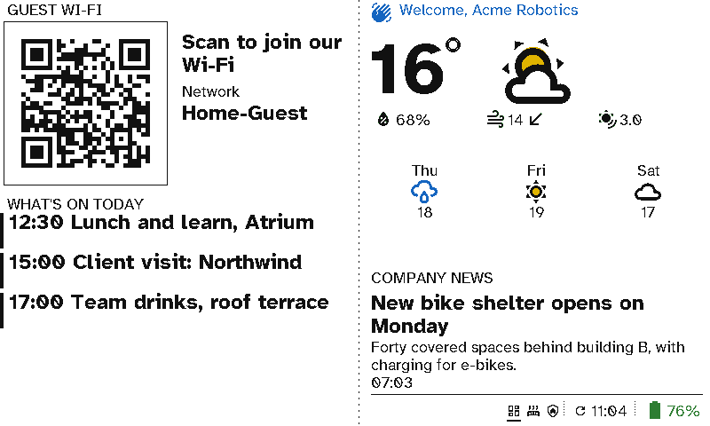

# Use cases

Switchboard puts e-ink where people need it: a remote in each room in place of the switches and remotes, and colour wall displays wherever people glance on their way past. This page lists the places it fits. Each one has its own page with the screens and the case for using Switchboard there.

## Why Switchboard

These points apply to every use case below.

- **One remote replaces five or six switches and remotes.** The lights and dimmers, the scenes, the blinds, the heating, the TV and the music all go on one screen you can carry to the sofa.
- **Plain English, so nobody needs training.** Every button says what it does, in your own words: *All lights*, *Movie night*, *Close blinds*. Guests, grandparents, the babysitter and new staff can use it without being shown.
- **No wiring and no glow.** E-ink reads like paper from across a room and only uses power to change the picture. A remote lasts about 30 days on a charge and a viewport around 3 months. See [Battery life](server/battery-life.md).
- **Live, not printed.** Screens come from Home Assistant and your calendars, so the sign on the door, the bins and the "back door unlocked" warning are always current.
- **One page to manage them all.** You build every screen on the server, in a browser. Moving a remote to another room or changing a sign takes seconds, with nothing to re-flash.

## At home

  <figure><a href="use-cases/living-room.html">

</a><figcaption><a href="use-cases/living-room.html"><b>Living room</b></a>: lights, TV and music on one remote</figcaption></figure>
  <figure><a href="use-cases/bedrooms.html">

</a><figcaption><a href="use-cases/bedrooms.html"><b>Bedrooms and kids' rooms</b></a>: blinds, heating and a nightlight from bed</figcaption></figure>

  <figure><a href="use-cases/kitchen.html">

</a><figcaption><a href="use-cases/kitchen.html"><b>Kitchen</b></a>: the day, energy, heating and security on the fridge</figcaption></figure>
  <figure><a href="use-cases/front-door.html">

</a><figcaption><a href="use-cases/front-door.html"><b>Front door</b></a>: what to sort out before you leave</figcaption></figure>
  <figure><a href="use-cases/energy.html">

</a><figcaption><a href="use-cases/energy.html"><b>Energy</b></a>: what to run now, and when the car charges</figcaption></figure>
  <figure><a href="use-cases/chores-and-pets.html">

</a><figcaption><a href="use-cases/chores-and-pets.html"><b>Chores and pets</b></a>: who fed the dog, and the jobs still to do</figcaption></figure>
  <figure><a href="use-cases/family-care.html">

</a><figcaption><a href="use-cases/family-care.html"><b>Family and care</b></a>: a clear day display for a parent or grandparent</figcaption></figure>

## At work

  <figure><a href="use-cases/reception.html">

</a><figcaption><a href="use-cases/reception.html"><b>Reception</b></a>: the guest Wi-Fi, what's on, a welcome, the weather and company news</figcaption></figure>
  <figure><a href="use-cases/meeting-rooms.html">

</a><figcaption><a href="use-cases/meeting-rooms.html"><b>Meeting rooms</b></a>: door signs and a room finder</figcaption></figure>
  <figure><a href="use-cases/facilities.html">

</a><figcaption><a href="use-cases/facilities.html"><b>Facilities</b></a>: the air and comfort in each room, and what needs attention</figcaption></figure>
  <figure><a href="use-cases/coworking.html">

</a><figcaption><a href="use-cases/coworking.html"><b>Co-working spaces</b></a>: members' Wi-Fi, free phone booths and today's events</figcaption></figure>
  <figure><a href="use-cases/building-sites.html">

</a><figcaption><a href="use-cases/building-sites.html"><b>Building sites</b></a>: wind warnings, deliveries and the safety record, with no mains</figcaption></figure>

## Hospitality and shops

  <figure><a href="use-cases/holiday-lets.html">

</a><figcaption><a href="use-cases/holiday-lets.html"><b>Holiday lets and guest rooms</b></a>: a welcome, the Wi-Fi to scan and the house notes</figcaption></figure>
  <figure><a href="use-cases/hotels.html">

</a><figcaption><a href="use-cases/hotels.html"><b>Hotels and B&amp;Bs</b></a>: breakfast, what's on, and <i>Do not disturb</i> on the door</figcaption></figure>
  <figure><a href="use-cases/shops-and-cafes.html">

</a><figcaption><a href="use-cases/shops-and-cafes.html"><b>Shops and cafés</b></a>: today's specials, what's sold out and the hours</figcaption></figure>

## Coming: events on the 13.3" board

  <figure><figcaption><a href="use-cases/events.html"><b>Events and wayfinding</b></a>: 13.3" signs that point the way and say what's on. Planned; these are mock-ups.</figcaption></figure>

