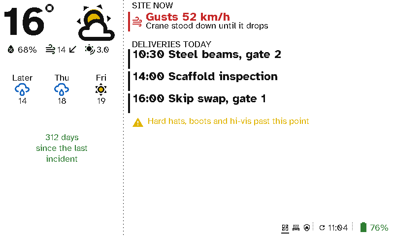

# Building sites

A site office or gate has no wall socket where you want a screen. A viewport runs for months on a charge and reads in daylight, with the wind, today's deliveries and the safety record.

  <figure>

<figcaption>A wind warning, today's deliveries, a safety reminder and the days since the last incident</figcaption></figure>

## The case for Switchboard

- **No mains needed.** It hangs in a cabin, at the gate or on a hoarding.
- **Readable in daylight.** E-ink is clearest in bright light, where a screen washes out.
- **Warnings that come and go.** *Gusts 52 km/h: crane stood down* shows only while the wind is over the limit.
- **Everyone knows the plan.** Deliveries come from the site calendar, so the gate knows what's arriving and when.

## Setting it up

*Weather* and a *Message* filled in from a counter sensor on the left; a *Now* item on a wind sensor, a *Calendar* and a *Message* on the right. See [Viewport layouts](../server/viewports.md).
