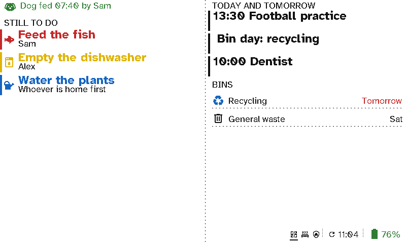

# Chores and pets

"Has anyone fed the dog?" A viewport in the kitchen answers it: when the dog was fed and by whom, the jobs still to do today, and who they're for. Ticked-off jobs disappear.

  <figure>

<figcaption>The dog fed and by whom, what's still to do, today's plans and the bins</figcaption></figure>

## The case for Switchboard

- **No double-feeding, no forgotten fish.** *Dog fed 07:40 by Sam* is on the wall for everyone to see.
- **Jobs that go away when they're done.** Each job shows in its own colour until it's ticked off, then disappears. Children can see what's left without a phone.
- **Plain words.** *Empty the dishwasher, Alex* needs no explaining.
- **On the fridge, with no cable.** It runs for months on a charge.

## Setting it up

Each job is a Home Assistant toggle (`input_boolean`), shown in a *Now* section while it's off. Tick it off from the Home Assistant app, a dashboard or an NFC tag by the dog bowl. *Dog fed {input_text.dog_fed}* is a *Message* filled in from a text helper that an automation sets.

Ticking jobs off with the viewport's own buttons is planned: today its three buttons change screens.
