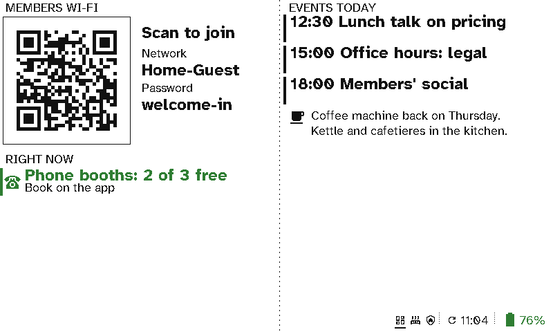

# Co-working spaces

A co-working space needs the same few things on every wall: the members' Wi-Fi, which phone booths are free, and what's on today. Viewports go up anywhere without cabling, and meeting rooms get their own signs.

  <figure>

<figcaption>The members' Wi-Fi, phone booths free right now, today's events and a note</figcaption></figure>
  <figure>

<figcaption>The room finder: which rooms are free now</figcaption></figure>

## The case for Switchboard

- **Nothing to wire in a space you rent.** Signs stick to glass and walls and run for months on a charge.
- **New members find their way.** The Wi-Fi is a code to scan, and the free booths and rooms are on the wall.
- **Events fill up.** Today's talks and socials come from your events calendar, so they're always current.
- **One page to run them all.** Change the Wi-Fi password or a note once and every board updates.
- **Room signs from the calendars you already have.** See [Meeting rooms](meeting-rooms.md).

## Setting it up

The board is two columns: *Guest Wi-Fi* and a *Now* section on the left, a *Calendar* and a *Message* on the right. See [Viewport layouts](../server/viewports.md) and [In the office](../viewport/office.md).
