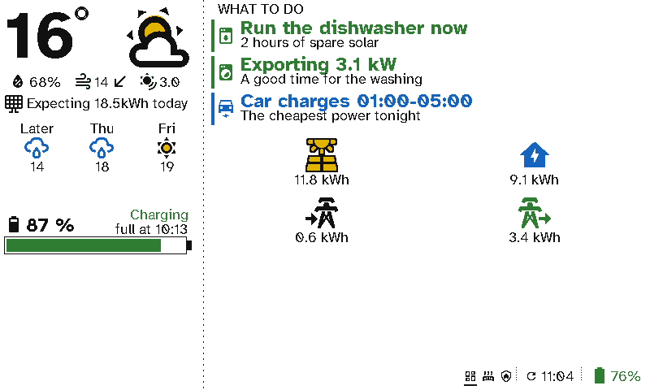

# Energy

Solar panels, a home battery and a time-of-use tariff only save money if someone acts on them. A viewport in the kitchen or utility room turns the numbers into what to do: run the dishwasher now, the car charges overnight.

  <figure>

<figcaption>What to do now, the battery, and today's solar, use and grid</figcaption></figure>
  <figure>

<figcaption>The energy screen: solar against the forecast, and where the power went</figcaption></figure>

## The case for Switchboard

- **Advice, not graphs.** *Run the dishwasher now: 2 hours of spare solar* is something anyone in the house can act on. A graph in an app isn't.
- **Seen where the decisions are made.** The washing machine, dishwasher and car are used by the whole household, not just whoever installed the solar app.
- **It only says something when it matters.** Each line shows only while its condition is true, so the list is short and always current.
- **E-ink costs almost nothing to run.** A display that tells you to save energy shouldn't be a tablet left on all day.

## Setting it up

This screen uses the *sidebar* layout:
- **Left:** *Weather* with the solar forecast, then *Battery*.
- **Right:** a *Now* section of entity items, then *Energy* totals.

Each *Now* item is a sensor and a condition. For example, a template sensor for the hours of spare solar, shown while it's over 1. The cheapest window can come from your tariff's Home Assistant integration. See [Viewport layouts](../server/viewports.md).
