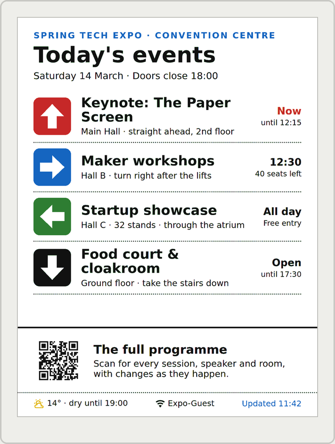
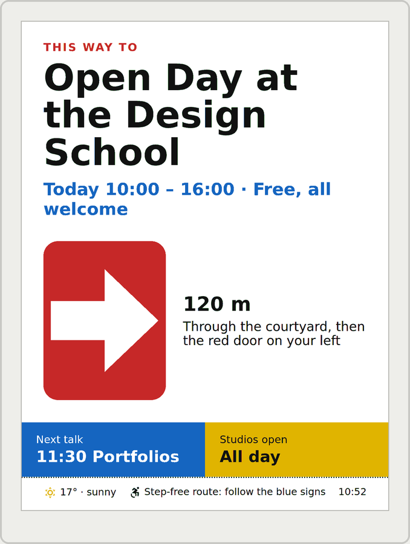

# Events and wayfinding

The <b>Seeed reTerminal E1004</b> is the same idea at 13.3", portrait or landscape: event signs that point the way and say what's on. These full-resolution signs are planned, not built yet: they're mock-ups at the panel's real resolution and in its six inks.

  <figure><figcaption>Event directory: every event with its arrow, where it is and what's on now</figcaption></figure>
  <figure><figcaption>This way to…: one event, the way there and the next talk</figcaption></figure>

## The case for Switchboard

- **Signs that change without reprinting.** Room changes, the next talk and *Doors open* come from a calendar, so the sign is right all day.
- **Put them anywhere.** No power needed at the easel or by the door.
- **Readable in sunlight.** E-ink looks like print in a bright window, where a screen washes out.
- **Change every board from one page.** Move a talk to another room once and every sign follows.

For menus and offers, see [Shops and cafés](shops-and-cafes.md).

## Status

The E1004's first firmware, [Switchboard Board](https://github.com/stumarti/Switchboard-Board), shows any viewport layout at twice the size, landscape, so the screens in this manual work on it today. It's new and not yet tested on the hardware. Full-resolution layouts like the ones above, portrait, and photos come later.
