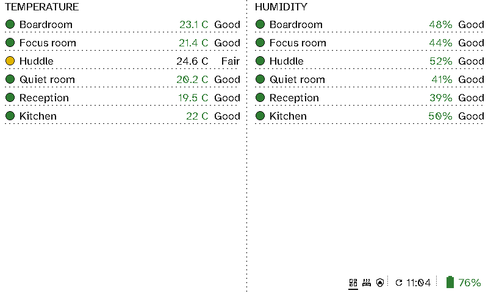

# Facilities

For whoever looks after a building, a viewport in the office or the plant room shows the air in each meeting room, and anything that needs attention: a failed backup, a hot plant room, a print that's running, free EV chargers.

  <figure>

<figcaption>The air in each room, coloured Good, Fair or Poor, and what needs attention in the building</figcaption></figure>
  <figure>

<figcaption>Comfort by room, measured by the meeting-room signs themselves</figcaption></figure>

## The case for Switchboard

- **Problems show up without a dashboard login.** *Backup failed* and *Plant room 31.5C* appear in red when they happen and disappear when they're fixed.
- **Air quality people act on.** CO2 and particles are coloured by sensible limits, or your own. A note such as *Huddle needs air: open the window or book another room* appears only when the room is poor.
- **Every sign is also a sensor.** Each viewport can report its room's temperature and humidity to Home Assistant. Put up twenty room signs and you have twenty comfort sensors at no extra cost.
- **Plain sentences, not graphs.** Anyone passing can understand *EV chargers: 2 of 4 free*.
- **Put it anywhere.** No power or network to run, and months on a charge, so it can go in the plant room, by the car park door or in the kitchen.
- **Comes from what Home Assistant already knows.** Any sensor or status becomes a line with your wording, colour and icon.

## Setting it up

This screen is two columns:
- **Left:** an *Air quality* section with one line per sensor, then a *Message* shown only while the huddle room's CO2 is over a limit.
- **Right:** a *Now* section of entity items, each with a condition, a title such as `Plant room {state}`, and a second line.

The comfort screen is two *Air quality* sections, one for the signs' temperatures with your own limits (fair from 24°C, poor from 26°C) and one for their humidity.

See [Viewport layouts](../server/viewports.md).
