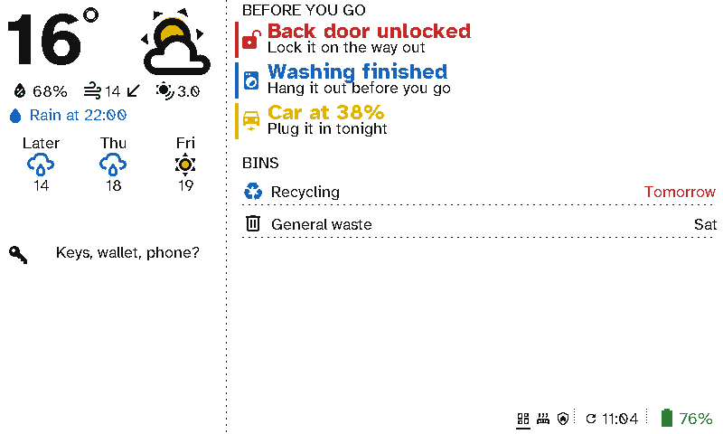

# Front door

The hall is the last place you pass before you leave. A viewport there answers the questions you'd otherwise ask on the doorstep: will it rain, is the back door locked, is the washing done, which bin goes out.

  <figure>

<figcaption>Before you go: the rain, a reminder, what to sort out, and the bins</figcaption></figure>
  <figure>

<figcaption>Another hall layout: the bins, a reminder, the air and the pollen</figcaption></figure>

## The case for Switchboard

- **It catches things before you've gone.** *Back door unlocked*, *Washing finished* and *Car at 38%* appear only when they're true, in red, blue or yellow, with a line saying what to do. When all is well, the list is empty.
- **The forecast that matters at the door.** The weather section says when the rain starts or stops today, not just a percentage.
- **The bins, sorted.** Collections come from your council's calendar link or a Home Assistant sensor. The night before, it says *Put out tonight*.
- **No wiring in the hall.** It hangs on a nail or sits on a shelf, and runs for months on a charge.
- **Your words.** The messages are yours: *Keys, wallet, phone?*

## Setting it up

This screen is two columns:
- **Left:** a *Weather* section with its rain outlook, then a *Message* with an icon.
- **Right:** a *Now* section of entity items, each with a condition and your own wording, then a *Bins* section.

See [Viewport layouts](../server/viewports.md) for each section's options.
