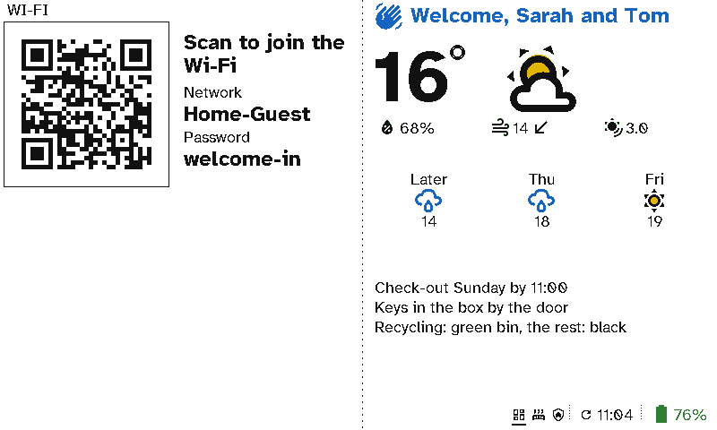

# Holiday lets and guest rooms

Guests want three things on arrival: the Wi-Fi, how the house works and when to leave. A viewport by the door gives them all three with their names on it, and a remote in each room means they never need the manual.

  <figure>

<figcaption>A welcome by name, the Wi-Fi to scan, the weather and the house notes</figcaption></figure>

  <figure>

<figcaption>The Wi-Fi on the remote too</figcaption></figure>
  <figure>

<figcaption>The heating, without a manual</figcaption></figure>
  <figure>

<figcaption>The TV and its apps</figcaption></figure>

## The case for Switchboard

- **Fewer messages from guests.** The Wi-Fi is a code to scan, and check-out, keys and bins are on the wall. Guests don't need to text you about them.
- **A welcome by name.** The name comes from a Home Assistant text field that an automation can fill from the booking.
- **The house explains itself.** A remote in each room has the lights, heating and TV in plain English. Guests from anywhere can use it without the folder of instructions.
- **One remote, not a drawer of them.** The TV, speaker and heating remotes can't go missing or leave in a suitcase.
- **You change it from home.** Update the notes, the Wi-Fi or the name from the server between stays.

## Setting it up

The viewport has a *Guest Wi-Fi* section on the left, and *Message*, *Weather* and another *Message* for the notes on the right. Each remote's layout includes the *Wi-Fi QR* page. See [Viewport layouts](../server/viewports.md) and [Remote layouts](../server/remote-layouts.md).
