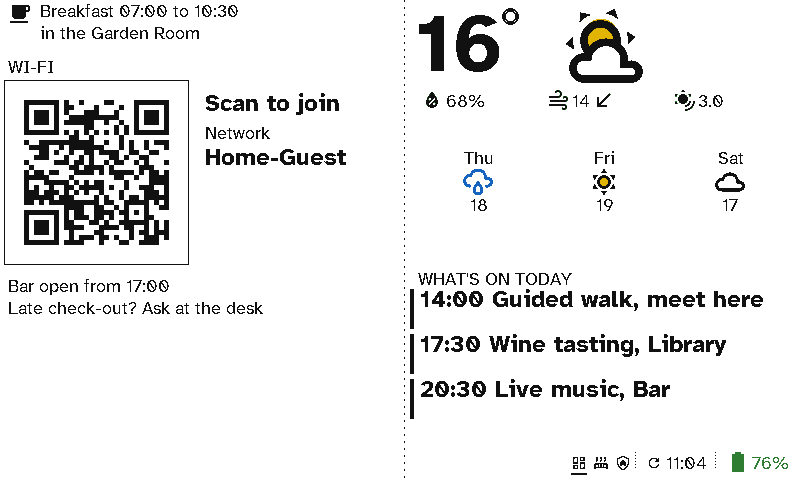
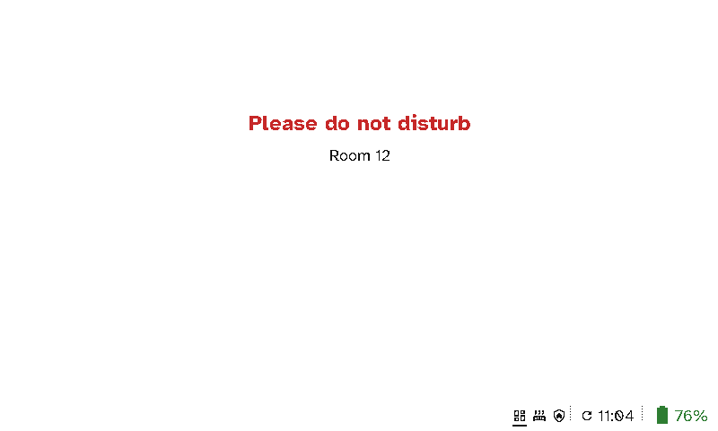

# Hotels and B&Bs

A viewport in the lobby gives guests breakfast times, the Wi-Fi and what's on today. One on a room door says <i>Please do not disturb</i>, so housekeeping doesn't have to knock.

  <figure>

<figcaption>The lobby: breakfast, the Wi-Fi to scan, the weather and what's on today</figcaption></figure>
  <figure>

<figcaption>A room door: <i>Please do not disturb</i>, only while it's on</figcaption></figure>

## The case for Switchboard

- **Fewer questions at the desk.** Breakfast times, the Wi-Fi and today's events are on the wall, so staff aren't asked them all day.
- **No reprinting.** The wine tasting moves to 18:00? Change the calendar and every board shows it.
- **A door sign that can't fall off.** *Do not disturb* comes from a toggle in Home Assistant, set from a switch in the room or the Home Assistant app, and housekeeping sees it without knocking.
- **Looks right in a nice building.** No glowing screen and no cable in a listed hallway. Months between charges.
- **One remote per room that guests understand.** The lights, heating and TV in plain English, with the Wi-Fi on it too. See [Holiday lets and guest rooms](holiday-lets.md).

## Setting it up

- **The lobby:** *Message*, *Guest Wi-Fi* and another *Message* on the left; *Weather* and a *Calendar* on the right.
- **The door:** a large red *Message* shown only while `input_boolean.dnd` is on, and the room number.

Setting *Do not disturb* with the viewport's own buttons is planned: today it comes from Home Assistant. See [Viewport layouts](../server/viewports.md).
