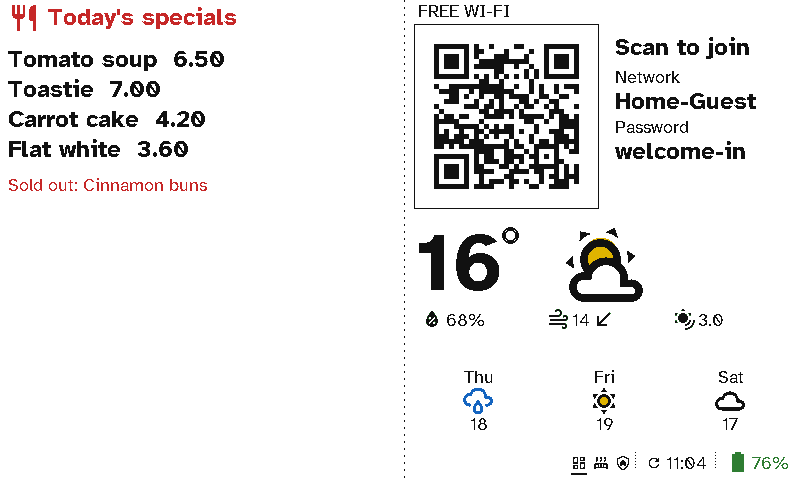

# Shops and cafés

A café's specials, a farm shop's prices or a bakery's <i>sold out</i> change through the day. A viewport on the counter shows them, with the Wi-Fi and today's opening hours. Change it once and it updates, with no chalk and no printer.

  <figure>

<figcaption>Today's specials, what's sold out, the free Wi-Fi, the weather and today's hours</figcaption></figure>

## The case for Switchboard

- **Update it from your phone.** *Sold out: cinnamon buns* comes from a text field in Home Assistant. Type it and the board shows it at its next refresh.
- **No cable across the counter.** Months on a charge.
- **Looks like print.** E-ink reads like a printed menu, not a TV.
- **Customers get online without asking.** The Wi-Fi is a code to scan.

## Bigger: the 13.3" board

The **Seeed reTerminal E1004** does this at 13.3". Its first firmware, [Switchboard Board](https://github.com/stumarti/Switchboard-Board), shows the screen above at twice the size; it's new and not yet tested on the hardware. Photos from Immich beside the live information are planned. This is a mock-up of that, at the panel's real resolution and in its six inks.

<figure class="shot"><figcaption>Mock-up: today's special, the price and a QR code, with live weather and opening hours</figcaption></figure>

## Setting it up

*Message* sections for the specials and *Sold out: {input_text.sold_out}* on the left; *Guest Wi-Fi*, *Weather* and a *Message* for the hours on the right. See [Viewport layouts](../server/viewports.md).
