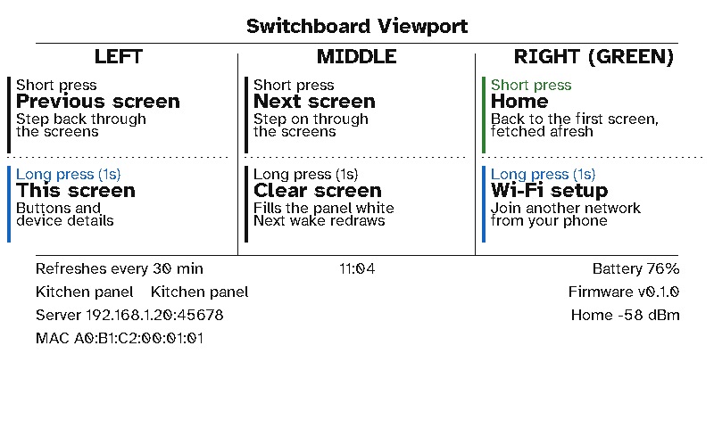

# Buttons, refresh and sleep

A viewport runs on battery, so it spends nearly all its time in deep sleep. It wakes on a timer the server sets, or when you press a button, fetches what changed, redraws if it has to, and goes back to sleep. A full refresh of the colour panel takes about 20 seconds. If a screen hasn't changed, the server answers `304` and the panel isn't touched.

## The buttons

<figure class="shot">

<figcaption>Device info (hold the left button): what each button does, and the display's state.</figcaption></figure>

The E1002 has three buttons along its top edge: left, middle, and the green one on the right.

| Button | Press | Hold (1 second) |
|---|---|---|
| **Left** (KEY2) | Previous screen | **Device info**: what each button does, the refresh interval, battery, firmware, server, Wi-Fi network and signal, MAC |
| **Middle** (KEY1) | Next screen | **Clear screen**: fill the panel white. The next wake redraws it |
| **Right, green** (KEY0) | Home: the first screen, fetched afresh | **Wi-Fi setup**: start the hotspot and QR codes again ([Setting up](setup.md)) |

They work the same on every screen, wrapping round at either end. With the kitchen dashboard, that's the panel's own buttons from Status (green for Status, middle for Heating, left for Security), and from Heating or Security the middle and left step on and back.

## The carousel

The layout's **Carousel → Between presses** setting decides what happens when nobody presses a button:

- **Stay on the current screen:** keep it on show and refresh it.
- **Move to the next screen:** every N minutes.
- **Go back to the first screen:** go back to the first screen N minutes after the last button press. The kitchen dashboard does this: Heating or Security goes back to Status after 30 minutes.

The display wakes in time for the next carousel step even if its normal refresh comes later.

## How often it refreshes

The server decides the time of each wake and sends it with every screen (`refreshInSec`). That time is:

- the layout's **refresh interval** (30 minutes for the kitchen dashboard);
- sooner when something is due: a meeting starting or ending, a departure becoming imminent, or a conditional section that's on show (every few minutes, so it stays current);
- never sooner than a minute, and never later than 12 hours.

**On the clock.** With the layout's **On the clock** switched on, the display refreshes at the interval's marks instead: :00 and :30 for 30 minutes, on the hour for an hour, and in quiet hours at that interval's marks. Like remotes, each display is 7 seconds after the one before (after all the remotes), so they don't all ask the server at once: with two remotes, the first display wakes at :00:14 and :30:14. It takes the time it spent drawing off its sleep, so it stays on its mark.

If the display can't reach Wi-Fi, the server or Home Assistant, it tries again after its usual interval (quiet hours included), remembered from the last time it reached the server. While it waits to be approved, it checks every 2 minutes.

## Quiet hours

During the layout's **Quiet hours** (11pm to 6am for the kitchen dashboard), the display wakes less often: every 30, 60, 120 or 240 minutes, as you choose. The footer shows a bed-and-clock icon while they last. The display wakes at the end of quiet hours to go back to its normal interval, and a button press still works as usual.

## Health

Every request carries the display's battery, its temperature and humidity (from its built-in sensor), its Wi-Fi signal, its firmware and its board. The server's [Home page](../server/home.md) and the display's own page show them and warn about a low battery or weak signal. The server also learns [how long the battery lasts](../server/battery-life.md) and flags a display it hasn't heard from in three of its refresh intervals.
