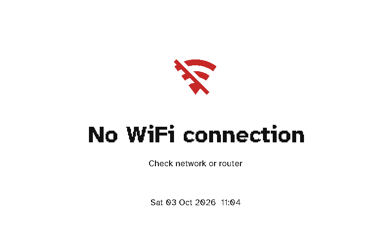
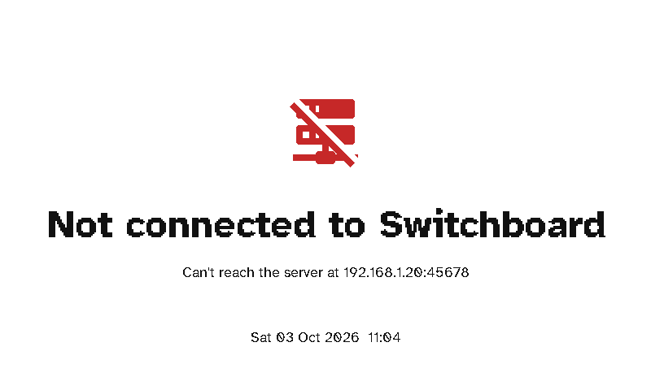
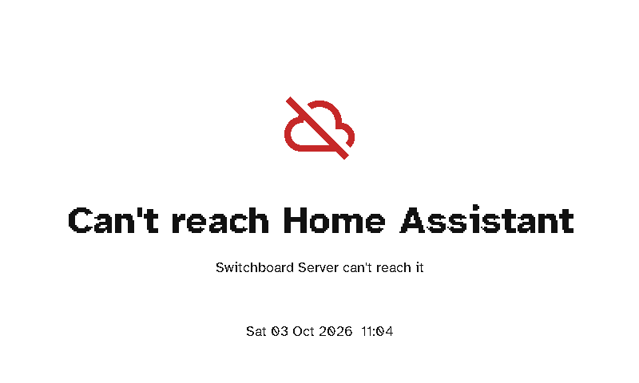
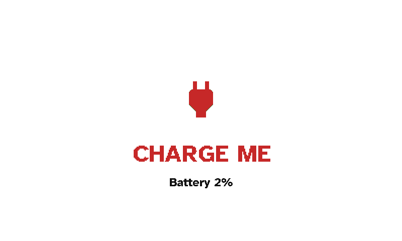

# When something's wrong

A viewport never hangs on a problem. It shows a plain screen saying what's wrong, with the date and time it last tried, and tries again after its usual interval (30 minutes, or the quiet-hours one overnight), or straight away if you press a button.

  <figure>

<figcaption>No Wi-Fi</figcaption></figure>
  <figure>

<figcaption>No Switchboard Server</figcaption></figure>
  <figure>

<figcaption>No Home Assistant</figcaption></figure>
  <figure>

<figcaption>Battery empty</figcaption></figure>

| Screen | What to do |
|---|---|
| **No WiFi connection** | Check the router. If the display has never joined the saved network, it starts [Wi-Fi setup](setup.md#2-connect-it-to-wi-fi) by itself. To change the network, hold the green button. |
| **Not connected to Switchboard** | The server isn't running, or the display can't find it. Check that the server is up, and that mDNS works on your network. If it doesn't, enter the server's address during Wi-Fi setup. |
| **Can't reach Home Assistant** | The server is running but can't reach Home Assistant: *Authentication failed - check token* if Home Assistant rejected the server's token, else *No response from Home Assistant*. Check **Settings → Home Assistant → Test** on the server. |
| **CHARGE ME** | The battery is at 2% or less. The display stops using Wi-Fi until it's charged, so plug in a USB-C cable. The server's Home page warns well before this point. |
| **Not set up yet** | The display is approved but has no layout. Choose one on its page on the server. |
| **Nothing to show** | The display's layout has every screen switched off. |

If the server stops answering after a firmware update, the display returns to its previous firmware by itself (see [Updates](updates.md)).
