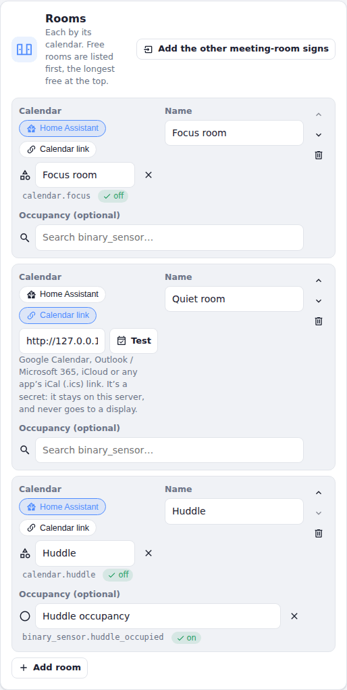
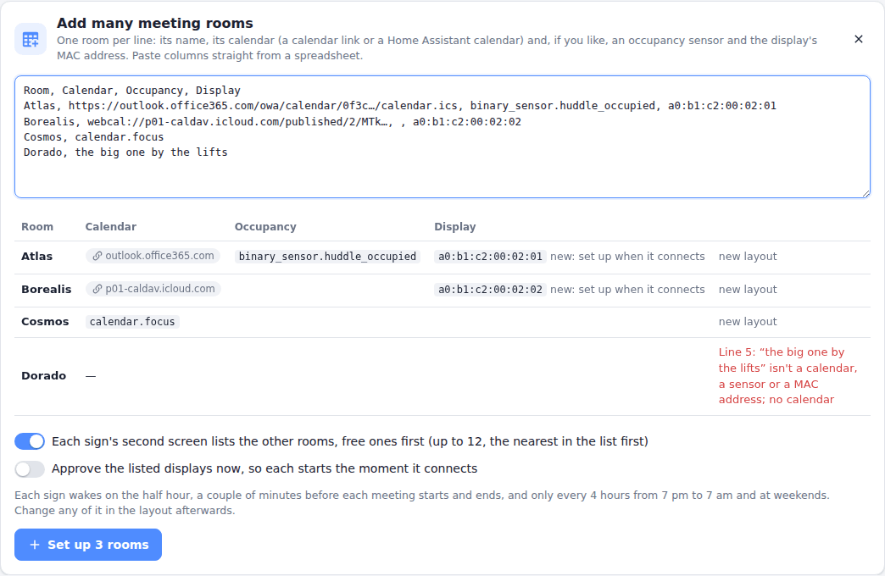

# Viewports in the office

A viewport makes a good meeting-room sign: it reads like paper from across a corridor, it has no glow and no cable, and it runs for months on a charge. This page covers what's different in an office:
- where the room calendars come from;
- when the signs change;
- how to put up many of them at once.

<div class="shots wide">
  <figure><div class="panel"></div><figcaption>A room's sign</figcaption></figure>
  <figure><div class="panel"></div><figcaption>Its second screen: the other rooms, free ones first</figcaption></figure>
</div>

A sign has two screens:
- **The room:** free, starting soon or in use, until when, a timeline of the next hours, and the meetings still to come.
- **The other rooms:** the ones free right now come first.

Press a button to switch to the other rooms; after five minutes the sign goes back to its own room. See [Viewport layouts](../server/viewports.md) for every option.

## Room calendars

Each room needs its own calendar. There are two ways to give it one.

- **A calendar link.** Most calendar apps can publish a calendar as an iCal (`.ics`) link. Paste it into the room's **Room calendar → Calendar link**, then press **Test** to check that the server can read it. The server reads the calendar itself. You don't need Home Assistant for this: an office that only has meeting-room signs can run Switchboard Server on its own.
- **A Home Assistant calendar.** Any calendar Home Assistant has works too, for example from its Google Calendar or CalDAV integration. Use this if you already run Home Assistant for the building, or need a calendar app that doesn't publish links.

<figure class="shot"><figcaption>A room on a calendar link, beside two on Home Assistant calendars. <b>Test</b> reads it and says what it found.</figcaption></figure>

A calendar link is a secret: anyone who has it can read the calendar. Switchboard keeps it on the server. Displays never get the link, only what they show, and if a link can't be read, the server names only its host.

### Getting the link

| Calendar | Where the link is |
|---|---|
| **Google Calendar / Google Workspace** | In Google Calendar's settings, pick the room's calendar, then **Integrate calendar → Secret address in iCal format**. A room booked as a Workspace *resource* is listed under **Other calendars** once you open it. If you don't see a secret address, your Workspace admin may have turned it off for the organisation. |
| **Microsoft 365 / Outlook** | In Outlook on the web: **Settings → Calendar → Shared calendars → Publish a calendar**. Pick the calendar and how much to share, press **Publish**, and copy the **ICS** link. For a room mailbox, an Exchange admin can publish it instead (see below). |
| **iCloud** | In the Calendar app, share the calendar as a **Public Calendar** and copy its `webcal://` link. |
| **Others** | Fastmail, Proton Calendar, Zoho, Nextcloud and most other apps give an iCal, ICS or `webcal://` link when you share or publish a calendar. |

**Room mailboxes in Microsoft 365.** Rooms booked as resources (`boardroom@yourcompany.com`) have no Outlook settings of their own, so an admin publishes them with Exchange Online PowerShell. This works one room at a time, or in a loop for all of them:

```powershell
Set-MailboxCalendarFolder -Identity "boardroom@yourcompany.com:\Calendar" -PublishEnabled $true -DetailLevel LimitedDetails
Get-MailboxCalendarFolder -Identity "boardroom@yourcompany.com:\Calendar" | Select-Object PublishedICalUrl
```

`LimitedDetails` publishes titles and times. Use `AvailabilityOnly` to publish only when the room is busy: the sign then shows *Busy* rather than a title. Your organisation's sharing policy must allow calendars to be published.

**What the sign shows of a meeting** is what the link publishes. To keep titles off a sign in a corridor, either publish availability only, or switch on **Hide meeting titles** in the room's layout.

**How fresh it is.** The server reads each link at most every 2 minutes. If a link can't be read, the server keeps the last good copy. The calendar service itself may take a while to update a published link after a booking changes: Outlook's published calendars in particular can lag. Book a test meeting to see how long yours takes. If it's too slow for your rooms, use Home Assistant's integration for that calendar instead.

**Recurring meetings, time zones and cancellations** come through as they do in the calendar app. That includes a weekly meeting's moved and cancelled occurrences, and Outlook's Windows time-zone names.

## When a sign changes

A sign spends almost all its time asleep. It wakes, asks the server what to show, redraws if anything changed (about 20 seconds for a full refresh of the colour panel), and goes back to sleep. In an office, it wakes at these times:

| When | Why |
|---|---|
| **2 minutes before each change** | A meeting starting or ending, a room's *Starting soon* (10 minutes before by default), or *Booked — no one here* (with an occupancy sensor). Waking and redrawing take about half a minute, so waking two minutes ahead means the sign has finished by the time it happens. |
| **On the half hour** | It checks for new and changed bookings, and moves the timeline on. The signs ask the server a few seconds apart, rather than all at once. |
| **Every 4 hours, 7 pm to 7 am and all weekend** | Quiet hours, so it doesn't use its battery when nobody's looking. It still wakes for a meeting booked in the evening. |
| **When someone presses a button** | For example, just after booking the room. It shows the latest straight away. |

For a meeting from 10:00 to 11:00, the sign:
1. wakes at 9:48 and shows *Starting soon* by 9:50;
2. wakes at 9:58 and shows *In use* by 10:00;
3. wakes at 10:58 and shows *Available* by 11:00.

Back-to-back meetings read as one busy block, with no flicker in between.

**Why two minutes.** Changing exactly on the minute means the sign shows the old status for the half minute it takes to redraw. A display's clock can also wake it a few seconds early or late. Two minutes covers both. Any more, and a room shows *In use* while people are still looking for somewhere to sit.

To change it, open the room's layout and set **Change the sign** to anything from *At the minute itself* to *5 minutes before*. The other rooms' screen has its own setting, **Change the list**.

**New bookings** show at the next wake: within half an hour, or as soon as a button is pressed. Each wake that redraws the sign costs battery, so it doesn't refresh more often.

**Battery.** The [Home page](../server/home.md) learns how fast each sign's battery goes down in real use, and tells you how many days it has left. The things that wake and redraw it most are:
- many short meetings;
- the timeline under the status bar, which moves on at every refresh;
- refreshing more often than every half hour.

For signs that need to last longer, turn the timeline off, or refresh every hour. A sign whose screen hasn't changed doesn't redraw at all.

## Putting up many at once

1. **Install the firmware** on each display from the [browser flasher](../../). Do it once per display, over USB.
2. **Put each one on the Wi-Fi.** Each display shows two QR codes; join its hotspot with a phone and pick the network ([Setting up](setup.md#2-connect-it-to-wi-fi)). This takes about a minute per display.
   - Displays need a network with a password (WPA2 or WPA3 Personal). They can't sign in to enterprise Wi-Fi (802.1X). Many offices have an IoT or devices network for this.
   - The network must be able to reach the server. If it's a separate network (VLAN), multicast usually doesn't cross to the server's, so the display can't find the server by itself. Type the server's address in **Switchboard Server** on the setup page, for example `10.20.0.5:45678`.
   - Once paired, displays also use every network saved under the server's **Settings → Wi-Fi**.
3. **Write down each display's MAC address.** A display shows it on its screen while it waits to be approved.
4. **Add the rooms.** On the **Layouts** page, under **Viewport layouts**, press **Add many meeting rooms** and paste the list of rooms: one per line, columns straight from a spreadsheet.
5. **Hang them up.** Each sign starts as soon as it's approved, or at its next check (every 2 minutes) if it was already waiting.

<figure class="shot"><figcaption><b>Layouts → Add many meeting rooms</b>: each line read as you type, and anything wrong with it shown before anything is made.</figcaption></figure>

Each line is a room's name, then its calendar, then optionally an occupancy sensor and the display's MAC address. After the name, the columns can be in any order: the server recognises a calendar link, a `calendar.` entity, a sensor and a MAC address. Separate them with commas, semicolons or tabs; a header row is skipped.

```
Room, Calendar, Occupancy, Display
Boardroom, https://outlook.office365.com/owa/calendar/…/calendar.ics, binary_sensor.boardroom_occupied, a0:b1:c2:00:01:01
Focus room, webcal://p01-caldav.icloud.com/published/2/…, , a0:b1:c2:00:01:02
Huddle, calendar.huddle
```

For each room, you get:
- **A sign layout** named after the room. Its second screen lists the other rooms, up to 12, starting with the nearest in your list. List the rooms floor by floor, and each sign's "other rooms" are its neighbours.
- **The office timing** above: changes 2 minutes ahead, refreshes on the half hour, and quiet from 7 pm to 7 am and all weekend.
- **Its display**, if the line has a MAC address: named after the room (“Boardroom sign”) and given the room's layout. This happens whether the display has connected yet or not. A display that hasn't connected yet is listed under **Viewports → Listed, not connected yet**.

Switch on **Approve the listed displays now** and each one starts the moment it first connects, with no one at the server. Otherwise, approve them when they appear.

Running it again with the same room names updates those rooms' signs rather than making new ones. That's the way to change many calendars at once, or to add a room to everyone's list. It sets each sign's room and other-rooms screens afresh, with the office timing; any other screens you've added to a sign stay.

**Displays already waiting.** When two or more displays are waiting to pair, the **Layouts** page lists them together. Give each a name and a layout, and approve them in one go. Each display shows its MAC address on its screen while it waits, so you can tell which is which.

**Why a layout per room.** Signs that look the same still need a layout each, because each has its own room's calendar. The room list makes them for you. To change something on every sign, such as the status words, edit the signs' layouts; to change the rooms, run the list again.

### Security

- **Keep the server on the office network.** Don't expose it to the internet ([Security](../server/security.md)): it holds the calendar links, and approves displays.
- **Approving ahead is a trade-off.** A display approved by MAC address before it connects saves a trip to the server. But anyone who copies that address onto another device on the same network gets what that sign shows: the room's bookings, no more. Only approve ahead on a network you control, or approve each display when it appears.
- **No new devices.** To stop new devices asking to pair once the signs are up, switch off **Settings → Security → Accept new devices**. Displays you've listed still connect.
