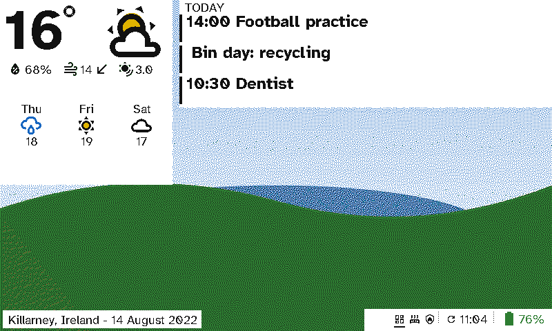
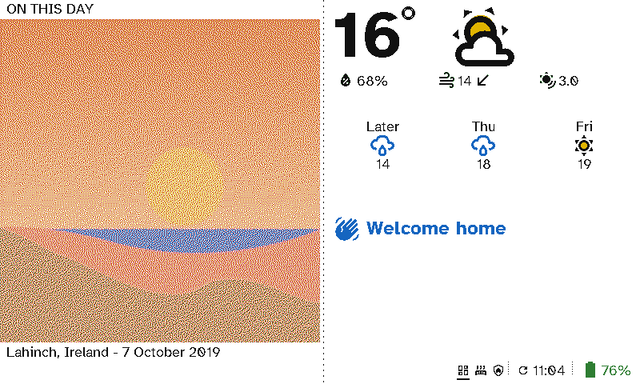
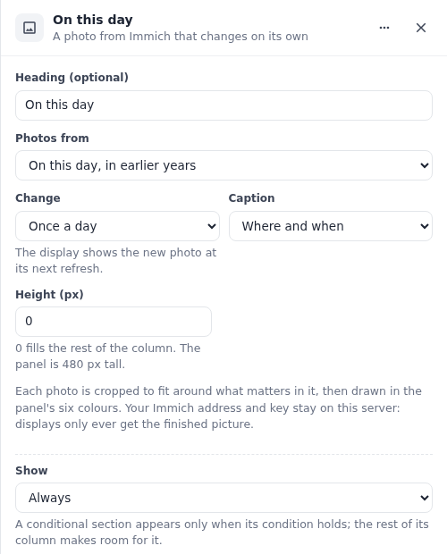
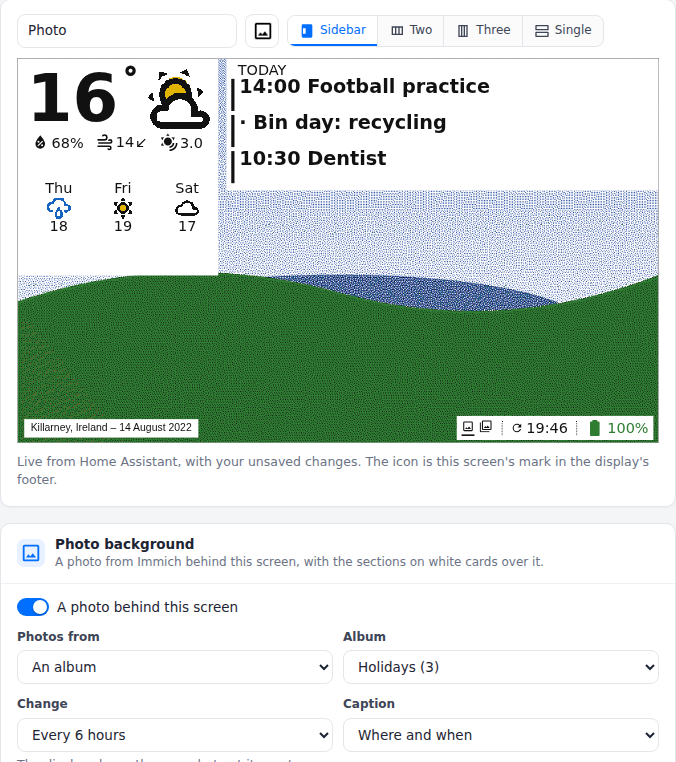

# Photos from Immich

A viewport can show photos from your own [Immich](https://immich.app) library, in two ways:
- **A photo section** sits in a column like any other section, beside the weather, a calendar or a message.
- **A photo background** fills the whole screen, and the other sections sit on white cards over it so their text stays readable.

  <figure>

<figcaption>A photo background: the weather and today on cards, where and when the photo was taken bottom left</figcaption></figure>
  <figure>

<figcaption>A photo section: "on this day", beside the weather and a welcome</figcaption></figure>

These are drawn by the viewport's firmware from the demo, whose pretend Immich serves drawn scenes rather than real photos.

## Connect Immich

1. In Immich, open your account's **Account settings → API keys** and create a key. Read access to albums, assets, people and memories is enough.
2. In Switchboard Server, open **Settings → Immich photos**. Enter Immich's address as the server reaches it (for example `http://192.168.1.20:2283`) and paste the key.
3. Press **Save**. The server tests the connection and shows whose library it is.

<figure class="shot"><figcaption><b>Settings → Immich photos</b>. Once saved, the key is never shown again: you can only replace or remove it.</figcaption></figure>

The address and key stay on the server. A display only ever gets the finished picture, so it never learns either of them.

## Add photos to a layout

**A photo section.** In a viewport layout, choose **Add a section → Photo** in any column, then pick:
- **Photos from:** your favourites, an album, a person you've named in Immich, "on this day" (photos taken on today's date in earlier years, or your favourites on a day with none), or anything in the library.
- **Change:** every 15 minutes to once a week. The display shows the new photo at its next refresh.
- **Caption:** none, when it was taken, where, or both.
- **Height:** in pixels, or 0 to fill the rest of the column.

<figure class="shot"><figcaption>A photo section's settings</figcaption></figure>

**A photo background.** Under the screen's preview, turn on **A photo behind this screen** and pick its photos, how often they change and the caption. Each section on the screen gets a white card. Leave a column empty, or use fewer sections, to show more of the photo.

<figure class="shot"><figcaption>A screen with a photo background, and its settings under the preview</figcaption></figure>

## How a photo reaches the panel

The server asks Immich for the photo and crops it to the space it fills, around the part that matters (faces, detail, colour) rather than its middle. It then turns it into the panel's six colours with the same dithering it uses for album art, matched to how the panel really looks.

The display downloads that picture once and keeps it. Within one change period the photo stays the same, so a display that wakes and finds nothing new goes straight back to sleep. A whole-screen photo is 192 KB. When the display's storage runs low, it clears its old pictures.

If Immich can't be reached, the server keeps using the last list of photos it read. A section with no photo shows a frame saying why, for example "Set up Immich in Settings" or "Pick an album".
