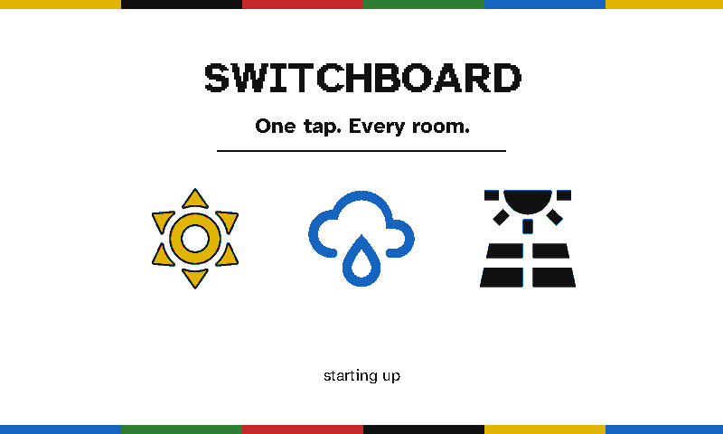
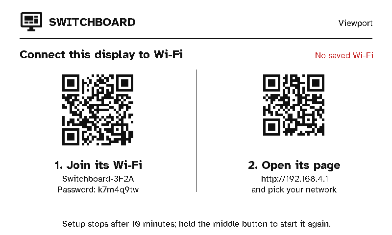
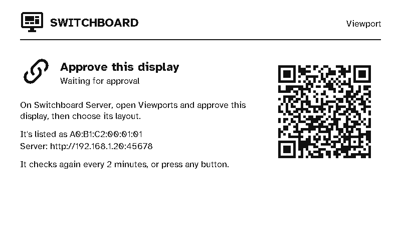
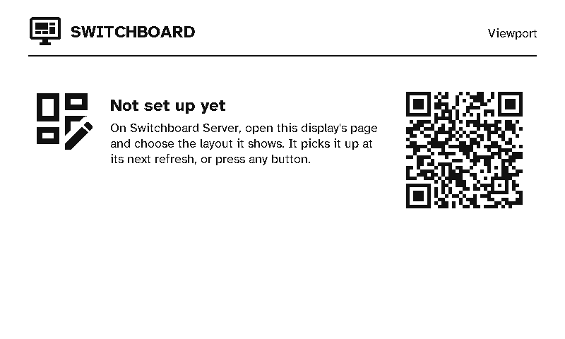

# Setting up a viewport

A viewport is a colour e-ink wall display that shows a layout from Switchboard Server. The firmware is [Switchboard Viewport](https://github.com/stumarti/Switchboard-Viewport), and it runs on the **Seeed reTerminal E1002**: a 7.3" Spectra 6 panel (white, black, red, yellow, green and blue), three buttons, a battery and a temperature/humidity sensor. The display has no touchscreen or keyboard, so you set it up with your phone.

<div class="shots wide">
  <figure><div class="panel"></div><figcaption>Starting up</figcaption></figure>
  <figure><div class="panel"></div><figcaption>Wi-Fi setup: two QR codes</figcaption></figure>
</div>

## 1. Install the firmware

The easiest way is the [browser flasher](../../): plug the reTerminal in by USB-C, open the flasher in Chrome or Edge on a desktop, and press **Connect & flash the viewport**. It installs the latest Switchboard Viewport release.

Or download the release yourself from the [Switchboard Viewport releases](https://github.com/stumarti/Switchboard-Viewport/releases). There are two files:

| File | What it's for |
|---|---|
| `switchboard-viewport-<version>.bin` | The whole flash image. Use this the first time, over USB. |
| `switchboard-e1002-app-<version>.bin` (and `.sha256`) | The app alone. This is what the server installs [over Wi-Fi](updates.md). |

Connect the reTerminal by USB-C and write the whole image at offset 0, for example:

```
esptool.py --chip esp32s3 write_flash 0x0 switchboard-viewport-<version>.bin
```

To build it yourself, see [Building the firmware](building.md). You only need USB once. After that, the server keeps the firmware up to date.

## 2. Connect it to Wi-Fi

With no Wi-Fi saved, the display starts its own hotspot and shows two QR codes:

1. **Join its Wi-Fi.** Scan the left code and your phone joins the display's hotspot (`Switchboard-XXXX`). Its password is printed under the code.
2. **Open its page.** Most phones open the page by themselves once they've joined. If yours doesn't, scan the right code or go to `http://192.168.4.1`.

On the page, pick your network (or type its name) and enter its password. **Switchboard Server** can be left empty: the display finds the server on your network by mDNS (`_switchboard._tcp`, or `switchboard.local`). Fill it in (`192.168.1.20:45678`) only if your network blocks mDNS.

The display joins the network and goes on to pair. Setup gives up after 10 minutes. To start it again at any time, for example to move the display to another network, **hold the green button** (on the right) for a second.

Once the display is paired, it also uses every network saved on the server (**Settings → Wi-Fi networks**), the strongest first. If a network goes away, the display can still join another one it knows.

## 3. Approve it on the server

<div class="shots wide">
  <figure><div class="panel"></div><figcaption>Waiting for approval</figcaption></figure>
  <figure><div class="panel"></div><figcaption>Approved, but no layout chosen</figcaption></figure>
</div>

The display asks the server to pair as a viewport and shows its MAC address while it waits. On the server, the request appears at the top of the **Remotes** page, and the Home page counts it under devices waiting for approval. Approve it **as a viewport** and choose its layout (see [Pairing & auth](../server/pairing-and-auth.md)). The display checks every 2 minutes, or straight away when you press a button.

If you approve it without a layout, it shows **Not set up yet** with a QR code for its page on the server. Choose a layout there, and the display picks it up at its next refresh, or when you press a button.

## 4. Choose what it shows

Everything a viewport shows comes from its [viewport layout](../server/viewports.md) on the server: the screens, what's in them, the carousel, quiet hours, and how often it refreshes. The display keeps nothing of its own except its Wi-Fi, its pairing, and a cache of what it last drew. The kitchen dashboard layout (**Start from… → Kitchen dashboard**) is the screen set the panel shipped with: [Status, Heating and Security](screens.md).
