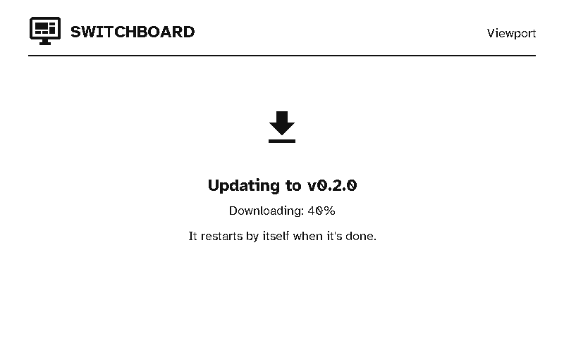

# Updates

<figure class="shot">

<figcaption>Installing an update</figcaption></figure>

Viewports update over Wi-Fi from the server, the same way remotes do. Firmware always comes from your own server, never straight from the internet. Everything is set up in the server's **Settings → Firmware updates**, which covers every kind of device. Each build is for one board, and a viewport's board is `e1002`. See [Remote updates](../server/remote-updates.md) for releases, pilot devices and the update window.

## Getting a release onto the server

**Switchboard Viewport** (`stumarti/Switchboard-Viewport`) is in the server's list of firmware repositories by default. Under **Builds**, **Get latest release** lists its releases. Add one and the server downloads `switchboard-e1002-app-<version>.bin`, checks it against its published `.sha256`, and reads the board and version from inside the image. You can also upload the `.bin` yourself. Then make it the `e1002` board's release.

## Installing

- **On a schedule:** at a timer wake during the server's update window.
- **Update now:** after **Update now** on the server's Home page, at the display's next timer wake, whatever the window.

A viewport has no menu, so there's no "check for update" button. A display that's due an update just installs it, shows its progress, and restarts.

## What keeps it safe

- **Battery:** an update won't start below the server's minimum battery (30% by default).
- **Integrity:** the image downloads into the spare app slot, and its SHA-256 is checked before the display switches to it.
- **The right device:** the image must say it's for the `e1002`. An image built for another kind of device is refused, whatever the server offers.
- **Rollback:** new firmware only counts as good once it reaches the server on its first run. Until then, a restart takes the display back to the previous firmware.
- **Reporting:** every attempt, good or bad, is reported to the server and shown on the display's page.
- **Retries:** if a scheduled update fails twice at the same version, the display doesn't try that version again until a different one is released.
